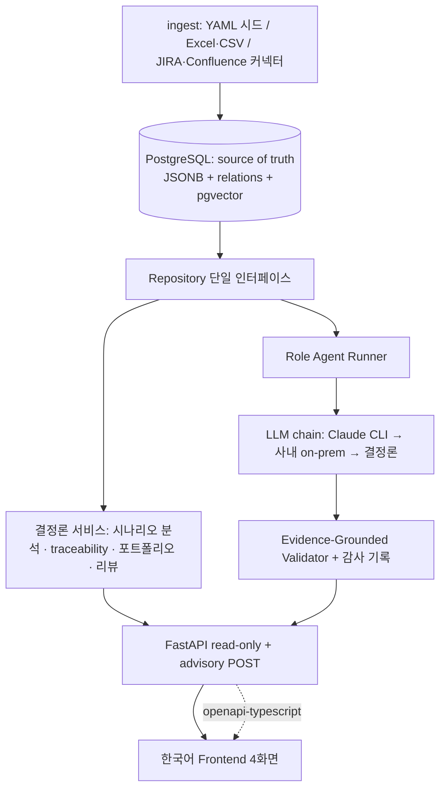

# CLAUDE.md — SoC Operational Ontology (운영 시스템)

> Multimedia SoC 개발 운영 온톨로지 — 사내 실사용을 목표로 하는 evidence-grounded 분석·조언 시스템.
> 56 PoC의 온톨로지를 승계하되, PoC가 아니라 **운영 시스템**으로 설계한다. 일반 챗봇이 아니다.

## 0-a. 로컬 실행 포트 규칙 (이 머신)

- **58 전용 포트: frontend `127.0.0.1:5275` / backend API `127.0.0.1:8155`.**
- 8000, 5173, 5174, 8100 등 다른 포트의 프로세스는 **다른 Claude Code 세션/프로젝트 소유** — 절대 종료하거나 사용하지 않는다.
- frontend 실행: `VITE_API_TARGET=http://127.0.0.1:8155 npx vite --port 5275 --strictPort`
- backend 실행: `uv run uvicorn backend.api.app:create_app --factory --port 8155`

## 0. Reference Directory (READ-ONLY)

```text
E:\56_Codex_SoC_Operational_Ontology
```

- 같은 프로젝트의 Codex PoC 구현체 (Stage 44 완료). 설계/도메인/데이터의 정본 참조.
- **절대 수정 금지.** 코드 무단 대량 복사 금지 — 계약을 이해하고 58 설계에 맞게 재구성한다.
- snapshot export/compare 회귀 도구 계열은 이식 대상이 아니다 (참조만).

## 1. 확정 결정사항 (2026-07-04)

1. **LLM 전략**: Claude CLI(headless)가 1차 엔진, 사내 on-premise OpenAI 호환 API가 2차 fallback(성능/속도 낮음), 결정론 코어가 3차 최종 fallback. 모든 LLM 출력은 evidence-grounded validator를 통과해야 하며 감사 기록을 남긴다. `allow_external_llm` 정책 스위치 필수.
2. **1차 페르소나**: 실무 리더의 시나리오 분석 — 업무 진행에 대한 근거 기반 조언이 핵심 가치. 시나리오 상세 화면이 최우선 UI.
3. **저장소**: PostgreSQL이 처음부터 source of truth. YAML fixture는 시드/테스트 전용. in-memory repository는 테스트/개발 전용 지위.
4. **한국어 1급**: 모든 객체/필드/enum에 `label_ko`를 glossary 계약으로 관리. UI는 한국어 기본. LLM 조언도 한국어 출력.
5. **계약 단일 소스**: Pydantic v2 모델이 단일 소스, JSON Schema는 자동 생성 (56의 수동 3중 동기화 폐기).
6. **Frontend**: 신규 구축. 업무 기반 4개 화면(포트폴리오 현황 / 시나리오 상세 / 리뷰 센터 / 근거 탐색) 상한. react-router + TanStack Query + openapi-typescript 타입 자동 생성.

## 2. 도메인 모델

### 2.1 Multimedia IP 범위

Functional MM IP: ISP(camera), DPU(display), MFC(codec), ABOX/VTS(audio), GPU, NPU.
System influence blocks: MIF/Memory, NoC/Bus(QoS), SystemMMU, Power/Clock/Thermal Control.
`CPU / Firmware Control Path`를 초기 system influence block으로 추가하지 않는다.

### 2.2 Role agents (정확히 이 7개)

Product Planning, SoC Architecture, System Engineering, HW Development, SW Development, PM, Management.

- Verification은 HW/SW Development **내부** 책임 — 독립 Verification agent 금지.
- 명칭은 `Management` (`Top Management` 금지).
- HW/SW Development는 아키텍처 결정을 직접 소유하지 않고, 구현에서 발견한 차기 SoC 개선 필요를 `feedback_items`로 System Engineering/SoC Architecture에 전달한다.
- Management는 role output과 리스크/비용 요약으로 트레이드오프를 결정하며 구현 세부를 직접 결정하지 않는다.

### 2.3 온톨로지 계층 (8모듈 통합 계약)

```text
project   : Project, Milestone, CustomerRequest, ProjectScenarioFocus
scenario  : ScenarioGroup, Scenario, Variant, ScenarioIPRequirement
ip        : IPBlock, SystemInfluenceBlock, IPBaseSpec, IPCapability, IPKnob, IPDependencyRule
event     : DevelopmentEvent(구 event+development_event 통합), Issue, KPIObservation
evidence  : Evidence, MeasurementEvidence, SemanticChunk
role      : RoleAgent, RoleOutput, Concern, FeedbackItem, ActionItem, RoleActivity
decision  : Risk, DecisionOption, Decision, ConfidenceAudit, DeRiskCandidate
relation  : Relation, SupportingBasis, AgentRun(감사 기록)
```

파생 뷰(portfolio board, weekly snapshot, scenario trace)는 저장 계약이 아니라 서비스 계층의 계산 결과다.

모든 저장 객체는 `source_origin: synthetic | imported | integrated` + `source_ref`를 가진다.

모든 분석 결과는 네 질문에 답한다: 무슨 일이 / 무엇에 영향 / 누가 왜 판단 / 어떤 결정·행동.

### 2.4 Synthetic universe

Project U(양산, N), V(N+1), W(N+2 스펙 선정·아키텍처 탐색 — IP 재사용과 기능 정당화가 사업성 관점에서 중요). RT KPI 제약은 camera/display/audio/NoC·MIF/SystemMMU 전반에 적용.

## 3. Evidence-Grounded 출력 규칙 (hard requirement)

모든 비자명한 `description`/`reason`/`feedback_items.description`은 다음을 갖춘다:

- `supporting_basis` — project/scenario/evidence/metric/rule/assumption/historical 참조 목록;
- `description_derivation` — 근거에서 서술이 도출된 과정;
- `confidence` — low / medium / high.

일반론 금지 ("리스크가 있으므로 검토 필요"). 근거 부족 시 `assumption`으로 표시하고 confidence는 medium 이하. 근거 없는 high confidence 금지. 검색된 semantic chunk는 후보일 뿐 증거가 아니다 — `supporting_basis`로 편입된 후에만 사용. **validator는 LLM provider와 무관하게 항상 실행되는 관문이다.**

## 4. 아키텍처



상세: `internal_docs/design/01_system_architecture.md`. 전체 Stage 계획: `internal_docs/design/02_implementation_roadmap.md`.

## 5. 기술 스택 & 명령

Backend: Python 3.11+, Pydantic v2, PyYAML, Typer + Rich, FastAPI, psycopg3, pytest, ruff, mypy. 항상 `uv` 사용 (`uv run`, `uv add`) — bare 인터프리터 금지.

Frontend: React 19 + TypeScript + Vite + react-router + TanStack Query + Vitest + ESLint. API 타입은 openapi-typescript 자동 생성 — 수동 타입 작성 금지. UI 문자열 하드코딩 영어 금지 (glossary 경유).

회귀 명령 (repository root):

```bash
uv run pytest -p no:cacheprovider
uv run ruff check backend tests
uv run mypy
uv run python -m backend.cli.main validate-data
```

Frontend(존재 시): `cd frontend && npm run build && npm run test && npm run lint`.

테스트는 네트워크/PostgreSQL/LLM 없이 통과해야 한다. DB 통합 테스트는 `POSTGRES_TEST_DSN`/`PGVECTOR_TEST_DSN` 게이트. LLM provider는 mock 계약 테스트로 검증.

## 6. 개발 규율

### 6.1 Scope lock

`CURRENT_TASK.md`가 활성 Stage의 scope lock이다. 이 파일 직후에 반드시 읽는다. 충돌 시 우선순위:

1. `CLAUDE.md` (프로젝트 전역 규칙)
2. `CURRENT_TASK.md` (활성 Stage 범위)
3. `internal_docs/design/` (58 설계문서)
4. `E:\56_...\docs\` (도메인 참조, read-only)

현재 Stage를 넘는 구현 금지. 미래 지향 라벨/플레이스홀더는 구현 근거가 아니다. Stage 완료 시: 수용 기준·회귀 명령 확인, changelog 갱신, 다음 `CURRENT_TASK.md` 준비 후 **정지** — 사용자 승인 없이 다음 Stage 진입 금지.

### 6.2 변경 규율

도메인 모델 변경 순서 — 코드 단독 변경 금지:

1. 설계문서 → 2. glossary/Pydantic 모델(단일 소스) → 3. JSON Schema 재생성 → 4. fixture → 5. 테스트 → 6. changelog.

### 6.3 구현 원칙

- 조회·현황·traceability는 항상 결정론. LLM은 advisory/질의 응답 생성에만 관여하며 provider chain + validator + 감사 기록을 우회할 수 없다.
- 온톨로지 데이터의 수정/삭제 API 금지 — 데이터는 ingest 계층으로만 진입, 삭제는 반입 단위 rollback만.
- **수치** 리스크/우선순위 스코어링, owner/task 자동 할당, 자율 멀티에이전트 토론 금지.
  단 **정성 위험 등급(높음/중간/낮음) + 판정 근거 목록 명시**는 허용 (2026-07-05 승인 — 원점 문서의 Milestone Risk Early Warning 복원, `internal_docs/design/03_course_correction.md` §4.1).
- 읽기 좋은 boring Python. 도메인 로직과 CLI/API 표현 분리. 비즈니스 로직에 synthetic ID 하드코딩 금지.
- 모든 비자명한 loader/validator/resolver/service 동작에 테스트.
- 설계 먼저, 코드 나중: 구현 전에 제안/설계를 확정한다.

## 7. 참조 문서 맵

| 필요 | 위치 |
|---|---|
| **원점 비전 (프로젝트의 최상위 기준)** | `D:\YHJOO\100_SoC_Operational_Ontology\01_Brainstorming\26.06.18 SoC ontology (ChatGPT).md` (read-only) |
| **교정 설계 — Stage 8~12 기준** | `internal_docs/design/03_course_correction.md` |
| **장기 개선 계획 — Stage 13~19 기준** | `internal_docs/design/05_long_term_improvement_plan.md` |
| UI 사용·해석 가이드 (사용자용 — GitHub Pages 소스, 내부 설계는 넣지 않음) | `docs/` |
| 58 시스템 아키텍처 (확정) | `internal_docs/design/01_system_architecture.md` |
| 58 전체 Stage 상세 계획 | `internal_docs/design/02_implementation_roadmap.md` |
| 활성 Stage 범위 | `CURRENT_TASK.md` |
| 도메인 목적/범위 (참조) | `56/docs/00_project_brief.md`, `56/docs/02_poc_scope.md` |
| Agent 계약/출력 스키마 (참조) | `56/docs/step0_poc_contract/` |
| Synthetic universe U/V/W (참조) | `56/docs/step1_synthetic_universe/` |
| 온톨로지 정의 (참조) | `56/docs/step2_ontology/` |
| Stage별 구현 설계 1~44 (참조) | `56/docs/implementation/` |
| 데이터 계약/fixture (참조) | `56/schemas/`, `56/synthetic_data/` |
| 동작 구현체 (참조) | `56/backend/`, `56/frontend/`, `56/tests/` |

## 8. 현재 상태

- Stage 1~7 구현 완료 (2026-07-04): 온톨로지 계약, PostgreSQL 계층, 결정론 서비스+API,
  한국어 frontend, LLM 3단 체인 advisory, Excel/CSV 반입. **이는 기반(foundation)이다.**
- **방향 교정 확정 (2026-07-05)**: 원점 문서 대비 검증 결과 TAT 단축 유스케이스 4종
  (위험 지도/변경 영향/RCA/Ask SoC)이 부재 → Stage 8~12로 복원한다.
  UI를 "질문이 곧 메뉴인 코크핏"으로 재편한다. 기준: `internal_docs/design/03_course_correction.md`.
- **Stage 8~12 교정 계획 완료 (2026-07-06)**: 5대 질문 코크핏 전부 활성 —
  위험 지도(8) / 변경 영향(9) / 이슈 분석 RCA+Test 온톨로지(10) / Ask SoC(11) /
  데모 스토리+TAT 측정(12). 56 드리프트 재동기화 완료(전 테스트 green, `_58` 오버레이 로더).
  문서: `docs/`=UI 가이드(Pages 소스), `internal_docs/`=설계·검증 자료.
- 활성 Stage 없음 — 다음 후보(워크숍 실행/Stage 13+ 커넥터·임베딩)는 `CURRENT_TASK.md` 참조,
  사용자 승인 후 착수.
- 진행 이력은 `CHANGELOG.md`, 원격은 github.com/younghwan78/SocDev_Operational_Ontology2.
