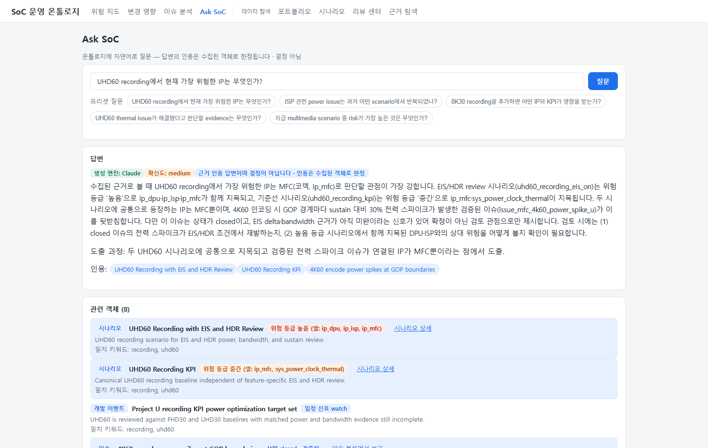

# Ask SoC — 자연어 질의 읽는 법

> 질문: **"과거 과제에서 비슷한 문제가 있었나?" 같은 것을 그냥 물어보고 싶다.**

Ask SoC는 온톨로지에 자연어로 질문하는 화면입니다. 홈(위험 지도) 상단의 검색창이나
상단 내비게이션의 Ask SoC에서 진입합니다.

## 동작 원리 — 답변을 신뢰할 수 있는 이유

1. **검색 (결정론)** — 질문 키워드로 온톨로지 객체(시나리오/이슈/테스트/이벤트/근거…)를
   찾고, 각 객체에 위험 등급·검증 상태 같은 결정론 요약을 붙여 "관련 객체 카드"를 만듭니다.
2. **답변 생성 (LLM)** — LLM은 **수집된 카드만** 근거로 한국어 답변을 작성하고,
   인용(citations)에 카드 ID만 넣을 수 있습니다.
3. **검증 관문** — 인용이 비었거나, 수집되지 않은 객체를 인용하거나, 근거가 약한데
   high 확신도를 주장하면 그 답변은 **버려지고** 다음 엔진으로 넘어갑니다.
4. **LLM 미가용 시** — 검색 결과와 결정론 상태 요약만으로 답합니다 (생성 엔진: 결정론 규칙).

즉, 어떤 경로로든 화면에 보이는 답변은 **인용 가능한 근거가 붙은 답변뿐**입니다.

## 화면 읽기

- **생성 엔진 뱃지** — Claude / 사내 LLM / 결정론 규칙. 어떤 엔진이 답했는지 항상 표시됩니다.
- **확신도** — low/medium/high. 근거가 부족하면 시스템이 high를 허용하지 않으므로,
  낮은 확신도는 결함이 아니라 **정직한 신호**입니다. "근거가 부족하다"는 답변 자체가
  근거 공백을 알려주는 유용한 답입니다.
- **인용 칩** — 클릭하면 아래 관련 객체 카드로 이동합니다. 인용은 항상 수집된 카드로
  한정되므로 답변의 모든 주장은 카드에서 검증할 수 있습니다.
- **관련 객체 카드** — 시나리오 카드는 시나리오 상세로, 이슈 카드는 이슈 분석(RCA)으로
  이어집니다. 파란 배경 카드가 답변에 인용된 카드입니다.
- **검증 기록** — LLM 답변이 거부된 이력이 있으면 접힌 항목으로 표시됩니다
  (예: "수집된 객체 밖의 인용 — 거부").

## 프리셋 질문 5종

원점 검증 질문들이 프리셋으로 제공됩니다:

1. UHD60 recording에서 현재 가장 위험한 IP는 무엇인가?
2. ISP 관련 power issue는 과거 어떤 scenario에서 반복되었나?
3. 8K30 recording을 추가하면 어떤 IP와 KPI가 영향을 받는가?
4. UHD60 thermal issue가 해결됐다고 판단할 evidence는 무엇인가?
5. 지금 multimedia scenario 중 risk가 가장 높은 것은 무엇인가?

## 질문 팁

- 데이터가 영어 중심이므로 **핵심 키워드(IP 이름, 시나리오, KPI)는 영어**로 쓰면
  검색이 정확합니다 (예: "ISP power", "UHD60", "underrun"). 문장 구조는 한국어여도 됩니다.
- "risk/위험"이 들어간 일반 질문은 위험 지도 상위 시나리오가 자동으로 함께 수집됩니다.
- 관련 객체가 하나도 안 잡히면 키워드를 바꿔 보세요 — 시스템은 검색되지 않은 것을
  지어내지 않습니다.

## 한계

- 답변 범위는 **수집된 카드(최대 8건)** 입니다. 전체 데이터를 한 번에 추론하지 않습니다.
- 깊은 분석이 필요하면 해당 전용 화면을 쓰세요: 위험 전반 → [위험 지도](risk-map.md),
  변경 파급 → [변경 영향](change-impact.md), 이슈 해결 여부 → [이슈 분석](issues.md).

돌아가기: [가이드 홈](index.md)
