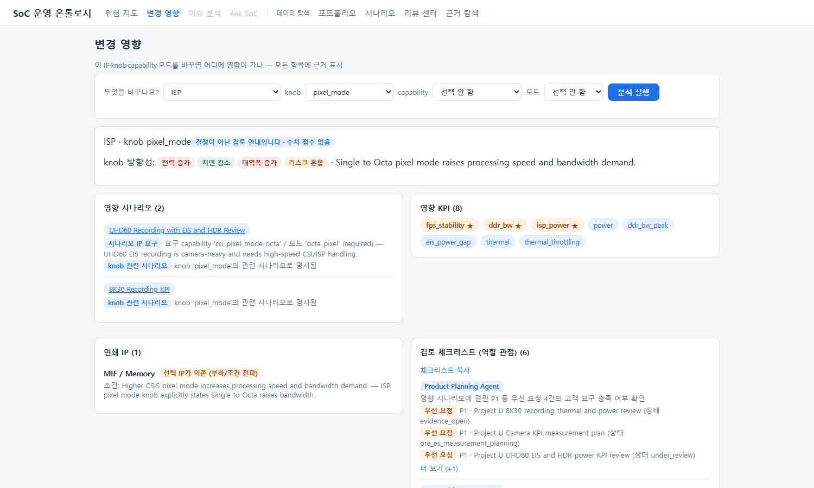
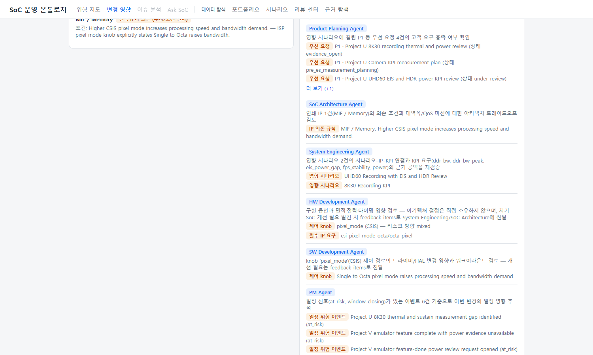

# 변경 영향 — 분석 실행과 4분면 해석

> 질문: **"이 IP·knob·capability·모드를 바꾸면 어디에 영향이 가나?"**

스펙 변경/튜닝 검토 전에 영향 범위를 사람이 수작업으로 추적하던 일을 대신합니다.
분석은 온톨로지 그래프(시나리오 요구, IP 의존 규칙, knob 정의, 과거 이슈·이벤트)의
**결정론 순회**로만 계산됩니다 — LLM 추측이 개입하지 않으며, 모든 항목에 근거가 붙습니다.

## 사용 순서

1. **무엇을 바꾸나요?** — 변경 대상 IP를 선택합니다 (필수).
   MIF/NoC 같은 시스템 블록도 선택할 수 있습니다.
2. 선택한 IP에 딸린 **knob / capability / 모드**를 선택합니다 (선택 사항).
   해당 IP에 없는 항목은 비활성화됩니다.
3. **분석 실행**을 누르면 결과가 표시됩니다.

**범위 규칙**: knob·capability·모드를 고르면 그것과 **직접 연결된** 시나리오로 범위가
좁혀집니다. 아무것도 고르지 않으면(IP만 선택) 그 IP를 사용/의존하는 모든 시나리오가
IP 수준 영향으로 표시됩니다. 좁은 질문일수록 좁은 답이 나옵니다.

## knob 방향성 뱃지

knob을 선택하면 결과 상단에 knob 정의에 기록된 방향성이 표시됩니다:

| 뱃지 | 의미 | 색 |
|---|---|---|
| 전력/지연/대역폭/리스크 **증가** | 그 축이 나빠지는 방향 | 빨강 |
| **감소** | 그 축이 좋아지는 방향 | 초록 |
| **혼합** | 조건에 따라 달라짐 — 조건을 확인할 것 | 노랑 |

## 4분면 읽기

### ① 영향 시나리오

이 변경이 닿는 시나리오 목록. 각 항목에 **왜 영향인지**가 뱃지로 붙습니다:

- `시나리오 IP 요구` — 시나리오가 이 IP에 특정 capability/모드를 요구함 (요구 수준 표기:
  required는 필수, candidate는 후보)
- `knob 관련 시나리오` — knob 정의에 관련 시나리오로 명시됨
- `IP 사용/의존` — IP 수준 영향 (구체 선택이 없을 때)

시나리오 이름을 클릭하면 시나리오 상세로 이동합니다.

### ② 영향 KPI

영향 시나리오들의 주요 KPI + knob이 직접 건드리는 KPI의 합집합.
**★ 표시가 knob 직접 영향** KPI로, 가장 먼저 확인할 지표입니다.

### ③ 연쇄 IP

IP 의존 규칙에 기록된 파급 경로. 방향 뱃지로 구분합니다:

- **선택 IP가 의존 (부하/조건 전파)** — 예: ISP 픽셀 모드를 올리면 MIF 대역폭 수요 증가.
  변경이 이 블록에 부하를 전파합니다.
- **선택 IP에 의존 (동작 영향)** — 예: MIF를 바꾸면 그에 기대던 ISP/MFC/NPU/GPU 동작이
  영향을 받습니다.

각 항목의 **조건** 문구가 핵심입니다 — 무조건적 의존이 아니라 "어떤 조건에서" 파급되는지
기록되어 있습니다.

### ④ 검토 체크리스트 (역할 관점)

이 변경을 검토할 때 **어느 역할이 무엇을 봐야 하는지**를 역할 책임 경계에 맞게 생성합니다.
근거(트리거)가 있는 역할만 항목이 생깁니다 — 형식적 일반론은 만들지 않습니다.

| 역할 | 항목이 생기는 조건 | 관점 |
|---|---|---|
| Product Planning | 영향 시나리오에 P0/P1 요청이 걸려 있음 | 고객 요구 충족 여부 |
| SoC Architecture | 연쇄 IP 존재 | 의존 조건·대역폭 마진 트레이드오프 |
| System Engineering | 영향 시나리오 존재 | 시나리오–IP–KPI 연결과 근거 공백 재검증 |
| HW Development | knob 또는 필수 요구 존재 | 면적·전력·타이밍 구현 영향 — 개선 필요는 feedback으로 전달 |
| SW Development | knob 존재 (드라이버 제어 항목) | 드라이버/HAL 제어 경로 영향 |
| PM | 영향 시나리오에 일정 위험 이벤트 존재 | 일정 영향 추적 |
| Management | 리스크 증가 knob 또는 P0 요청 | 트레이드오프 요약 검토 (구현 세부 결정 아님) |

**체크리스트 복사** 버튼은 결과 전체(시나리오/KPI/연쇄/체크리스트/유사 사례)를 텍스트로
클립보드에 복사합니다 — 회의록이나 메신저에 붙여 쓰세요.

## 과거 유사 사례

같은 IP 조합에서 발생했던 이슈(빨간 뱃지)와 이벤트가, 이번 영향 시나리오와 몇 건
겹치는지와 함께 표시됩니다. "이 변경, 예전에 어디서 문제됐었지?"에 대한 답입니다.

## 해석 시 주의

- capability를 선택했는데 영향 시나리오가 예상보다 적다면: capability↔요구 연결은
  **확실한 일치만** 인정하는 보수적 매칭입니다. 근거 없는 연결을 만들지 않는 대가로,
  데이터에 링크가 기록되지 않은 관계는 나오지 않습니다.
- 결과는 온톨로지에 **기록된** 그래프의 순회입니다. 기록되지 않은 의존은 보이지 않으므로,
  체크리스트의 역할 검토가 그 공백을 메우는 장치입니다.
- 결정이 아닌 검토 안내입니다 — 수치 점수 없음.

다음: [데이터 탐색 가이드](explorer.md) · [공통 개념](concepts.md)
