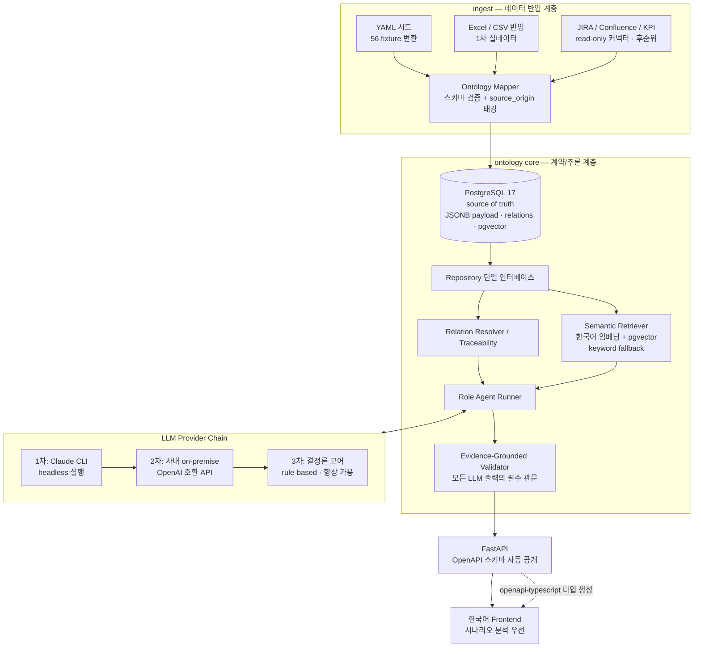
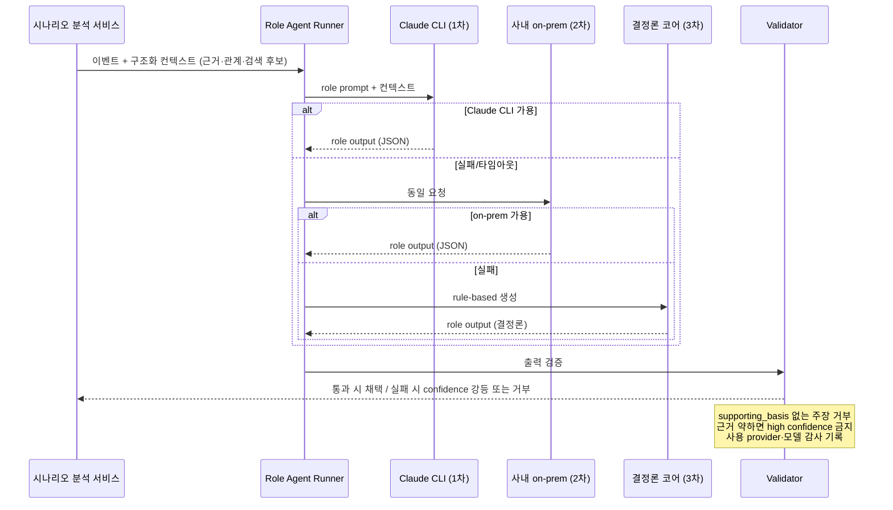

# 시스템 아키텍처 설계 — SoC Operational Ontology (운영 시스템)

> 상태: v1.0 확정안 (2026-07-04)
> 참조: `E:\56_Codex_SoC_Operational_Ontology` (read-only, Stage 44 완료 PoC)

## 1. 목적

56 PoC가 검증한 온톨로지와 evidence-grounded 규율을 기반으로, **사내에서 실제 업무에 사용할 수 있는 SoC 개발 운영 온톨로지 시스템**을 구축한다.

56과의 목적 차이:

| 항목 | 56 (PoC) | 58 (운영 시스템) |
|---|---|---|
| 데이터 | synthetic YAML fixture 고정 | 가상 데이터로 시작, 실데이터 반입이 1급 요구사항 |
| 저장소 | in-memory 기본, PostgreSQL은 optional adapter | **PostgreSQL이 source of truth**, fixture는 시드/테스트 전용 |
| LLM | 전면 금지 (결정론 mock만) | Claude CLI 주 엔진 + 사내 on-premise fallback |
| UI | Stage별 누적 16개 페이지, 영어 | 업무 기반 4개 화면, **한국어 기본** |
| 1차 사용자 | 개발자(계약 검증) | **실무 리더 — 시나리오 분석과 업무 조언** |

## 2. 확정 결정사항 (2026-07-04)

1. **LLM 전략**: 사내 OpenAI 호환 LLM/임베딩 API 사용 가능. 단 성능/속도 한계가 있으므로 **Claude CLI(구독 기반)를 주 엔진**으로, 사내 on-premise 모델을 fallback으로, 결정론 코어를 최종 fallback으로 하는 3단 어댑터 체인을 구성한다.
2. **1차 페르소나**: 실무 리더의 시나리오 분석. 실무자가 업무 진행에 대한 조언(evidence-grounded advisory)을 받는 것이 핵심 가치.
3. **Backend 이식 범위**: 실사용 관점에서 재구성. 56의 snapshot export/compare 회귀 도구 계열은 이식하지 않고 참조로만 활용.

## 3. 전체 아키텍처



## 4. 온톨로지 계약 전략

### 4.1 저장 계약과 파생 뷰의 분리 (56 부채 해소의 핵심)

56은 저장 객체(project, event, evidence)와 파생 뷰(portfolio_review_board, weekly_activity_snapshot, scenario_trace_playback)를 같은 층위의 스키마 30개로 관리했다. 58은 이를 분리한다:

- **저장 계약 (persisted ontology)**: PostgreSQL에 저장되는 온톨로지 객체. Pydantic 모델이 단일 소스.
- **파생 뷰 (derived view)**: 저장 객체에서 결정론적으로 계산되는 API 응답 모델. 저장하지 않고 서비스 계층에서 생성.

### 4.2 스키마 통합 매핑 (56의 30개 → 58의 8개 모듈)

| 58 모듈 | 흡수하는 56 스키마 | 비고 |
|---|---|---|
| `project` | project, project_scenario_focus, (project_links, project_milestones fixture) | 마일스톤·고객요구 포함 |
| `scenario` | scenario_group, scenario_ip_requirement, (scenarios, variants fixture) | 시나리오·변형·IP 요구 |
| `ip` | ip, ip_base_spec, ip_capability, ip_knob, ip_dependency_rule | IP 스펙 계층 통합 |
| `event` | **event + development_event 통합** (중복 계약), issue | development_event 필드셋 기준 |
| `evidence` | evidence, (measurement_evidence, evidence_catalog fixture), semantic_chunk | 근거·측정·시맨틱 청크 |
| `role` | role_agent, role_output, feedback_item, action_item, role_agent_activity | evidence-grounded 출력 계약 |
| `decision` | decision, risk, decision_confidence_audit, de_risk_backlog | 결정·리스크·감사 |
| `relation` | relation, ontology_object, simulation_run | traceability 골격 |
| (파생 뷰로 격하) | portfolio_review_board, weekly_activity_snapshot, scenario_trace_playback, workflow | 저장하지 않음 |

### 4.3 계약 동기화: 3중 수동 → 단일 소스 자동 생성

56은 JSON Schema ↔ Pydantic ↔ YAML을 수동으로 3중 동기화했다. 58은 **Pydantic v2 모델을 단일 소스**로 하고 JSON Schema는 `model_json_schema()`로 자동 생성·export한다. 동기화 대상이 모델↔fixture 2개로 줄고, 스키마 드리프트가 원천 차단된다.

### 4.4 한국어 1급 지원

- 모든 객체 타입/필드/enum 값에 `label_ko`를 도메인 용어집(`ontology/glossary.py` + `glossary.yaml`)으로 정의. UI 번역이 아니라 온톨로지 메타데이터.
- 용어 예: `supporting_basis` → "뒷받침 근거", `evidence_blocked` → "근거 부족", `confidence` → "확신도", `de-risk` → "리스크 해소".
- 콘텐츠 필드(description 등)는 한국어 작성이 기본. 시맨틱 검색은 한국어 임베딩을 전제로 설계.

### 4.5 실데이터 좌석 확보

모든 저장 객체 공통 필드:

```text
source_origin  : synthetic | imported | integrated
source_ref     : 원본 참조 (파일 경로, JIRA key, Confluence URL 등)
ingested_at    : 반입 시각
```

## 5. 데이터 계층

- **PostgreSQL 17** + psycopg3. 56의 검증된 패턴(관계 컬럼 + JSONB payload + relations 테이블 + pgvector-ready semantic_chunks) 유지.
- 마이그레이션: 버전드 SQL 파일 + 경량 러너 (boring approach, 56 `db/postgres/schema.py` 자산 참조). SQLAlchemy/Alembic 도입하지 않음.
- 개발/테스트는 YAML fixture 시드로 DB 없이도 구동 가능 (in-memory repository 유지 — 단 optional이 아니라 테스트 전용으로 지위 변경).
- 56 `synthetic_data/*.yaml`은 변환 스크립트로 58 계약에 맞춰 반입 (56 원본 무수정).

## 6. LLM Provider Chain



원칙:

- Provider는 `LLMProvider` 프로토콜 하나로 추상화: `claude_cli` / `openai_compatible` / `deterministic`.
- **Validator는 provider와 무관하게 항상 실행** — 어떤 LLM이든 evidence-grounded 계약을 통과하지 못한 출력은 채택되지 않는다.
- 모든 LLM 호출은 provider, 모델명, 소요시간, 검증 결과와 함께 감사 기록(`agent_run` 테이블)에 남긴다.
- 사내 데이터 보안: 실데이터 반입 이후 Claude CLI(외부) 사용 범위는 회사 보안 정책에 따라 provider 설정으로 제어 가능해야 한다 (`allow_external_llm: true|false`, 객체·프로젝트 단위 오버라이드).
- 임베딩: 사내 OpenAI 호환 임베딩 API + pgvector. 미가용 시 keyword retriever fallback (56 mock retriever 패턴).

## 7. 서비스 계층 — 시나리오 분석 우선

1차 페르소나(실무 리더) 기준 핵심 서비스:

| 서비스 | 기능 | LLM 사용 |
|---|---|---|
| **ScenarioAnalysis** | 시나리오 현황 종합: 관련 이벤트/이슈/근거/리스크 취합, 근거 공백 진단 | 아니오 (결정론) |
| **ScenarioAdvisory** | role agent 관점의 업무 조언 생성: 다음 확보할 근거, 검토 관점, 리스크 우선순위 | **예 (chain)** |
| Traceability | 임의 객체에서 supporting_basis drill-down | 아니오 |
| Portfolio | U/V/W 현황 파생 뷰 (56 review board 통합) | 아니오 |
| Review | 주간 리포트·감사·백로그 파생 뷰 | 아니오 |

## 8. API 표면

- 조회는 전부 GET (read-only). 유일한 상태 변경성 엔드포인트는 분석 실행:
  - `POST /api/v1/scenarios/{id}/advisory` — LLM 조언 생성 (결과와 감사 기록 저장)
  - `POST /api/v1/ingest/excel` — 반입 실행 (Phase 3)
- 온톨로지 데이터 자체의 수정/삭제 API는 두지 않는다 (반입 계층 경유만 허용).
- OpenAPI 스키마 자동 공개 → frontend 타입 자동 생성 (`openapi-typescript`).
- 56의 41개 엔드포인트를 그대로 승계하지 않고, 4개 화면이 실제 소비하는 것만 노출.

## 9. Backend 패키지 구조

```text
backend/
  ontology/          # 계약 계층: Pydantic v2 모델 (단일 소스), glossary, JSON Schema export
    project.py scenario.py ip.py event.py evidence.py role.py decision.py relation.py
    glossary.py common.py schema_export.py
  db/                # PostgreSQL: connection, migrations/*.sql, repository
  ingest/            # yaml_seed.py, excel_csv.py, (later) jira.py confluence.py
  resolve/           # relation resolver, traceability
  retrieval/         # embedding_provider.py, pgvector_retriever.py, keyword_retriever.py
  agents/            # runner.py, validators.py, providers/{claude_cli,openai_compat,deterministic}.py
  services/          # scenario_analysis.py, scenario_advisory.py, portfolio.py, review.py
  api/               # FastAPI app, routes/
  cli/               # typer: db-init, ingest, validate-data, advisory-run
tests/
docs/
fixtures/            # 시드 YAML (56 synthetic_data 변환본)
frontend/            # Phase 2에서 신규 구축
```

56에서 이식하지 않는 것: snapshot export/compare 계열, stage별 validation 모듈 9개(통합 validator로 재작성), 파생 뷰의 저장 계약들.

## 10. 비기능 요구사항

- **감사(audit)**: 모든 advisory 실행은 입력 컨텍스트 해시, provider, 출력, 검증 결과를 기록. "누가 언제 어떤 근거로 이 조언을 받았나"에 답할 수 있어야 함.
- **보안**: 실데이터 단계부터 on-prem 우선 원칙 적용 가능해야 함 (provider 정책 스위치). 반입 커넥터는 read-only 계정만 사용.
- **결정론 보존**: LLM이 개입해도 조회·현황·traceability는 항상 결정론. LLM은 advisory 생성에만 관여.
- **테스트**: 네트워크/DB/LLM 없이 통과하는 단위 테스트가 기본. DB 통합 테스트는 DSN 환경변수로 게이트. LLM provider는 계약 테스트(mock)로 검증.

## 11. 단계 로드맵

| Stage | 범위 | 산출물 |
|---|---|---|
| **1** | 온톨로지 v1.0 계약 + 프로젝트 스캐폴드 | ontology 모델 8모듈, glossary, 56 fixture 변환 시드, validate CLI, 테스트 |
| 2 | PostgreSQL 계층 + repository | migrations, 반입(yaml_seed), DB/메모리 repository 패리티 |
| 3 | 결정론 서비스 + API | ScenarioAnalysis, Traceability, Portfolio GET API |
| 4 | 한국어 Frontend — 시나리오 상세 화면 | ② 시나리오 상세 (개요·타임라인·이벤트·추적 탭) |
| 5 | LLM Provider Chain + ScenarioAdvisory | Claude CLI/on-prem/결정론 체인, validator, 감사 기록, advisory API·UI |
| 6 | 나머지 화면 (포트폴리오 현황, 리뷰 센터, 근거 탐색) | 화면 ①③④ |
| 7 | Excel/CSV 실데이터 반입 파일럿 | ingest 어댑터, source_origin 구분 UI |
| 8+ | JIRA/Confluence 커넥터, 임베딩 retrieval 고도화 | 사내 승인 일정 연동 |

각 Stage는 `CURRENT_TASK.md` scope lock으로 통제하며, 완료 후 사용자 승인 없이 다음 Stage로 진행하지 않는다.
