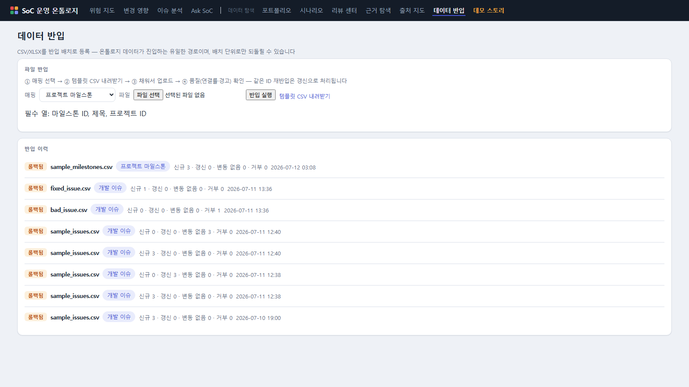

# 데이터 반입 — 실데이터를 넣는 유일한 경로

> 질문: **"우리 과제의 이슈/테스트/근거를 어떻게 시스템에 넣나?"**

온톨로지 데이터는 **반입 배치**로만 들어옵니다. 화면에서 개별 객체를 수정하는 기능은
의도적으로 없습니다 — 잘못 들어온 데이터는 배치 단위로만 되돌립니다(감사 가능성).

## 기본 흐름 — ① 매핑 → ② 템플릿 → ③ 업로드 → ④ 품질 확인

1. **매핑 선택** — 무엇을 반입하나: 개발 이슈 / 검증 테스트 / 개발 이벤트 /
   근거 카탈로그 / 측정 근거 / 리뷰 결정 / 액션 아이템 등. 필수 열이 함께 표시됩니다.
2. **템플릿 CSV 내려받기** — 열 이름(한국어)이 계약입니다. 엑셀로 채우세요.
   리스트 값은 세미콜론(`;`)으로 구분합니다 (예: `uhd60_recording_eis_on;apv_recording`).
3. **업로드** — 결과가 4개 숫자로 나옵니다:
   - **신규** — 처음 들어온 행
   - **갱신** — 같은 ID의 내용이 바뀌어 교체됨
   - **변동 없음** — 같은 ID·같은 내용이라 건너뜀 (**같은 파일을 다시 올려도 안전**)
   - **거부** — 필수 열 누락 등. 사유가 행 번호와 함께 한국어로 표시됩니다.
4. **품질 확인** — 반입 성공 ≠ 활용 가능. 세 가지를 봅니다:
   - **온톨로지 연결률** — 시나리오/IP에 연결되지 않은 행은 위험 지도·RCA에
     나타나지 않습니다. 연결률이 낮으면 영향 시나리오/IP 열을 채우세요.
   - **라벨 미등재 값** — 시스템이 모르는 상태/유형 값. 관리자에게 알려 라벨을 등록합니다.
   - **참조 없음 경고** — 존재하지 않는 과제/시나리오 ID를 참조한 행 (경고이지 거부는 아님).

## 큐레이션 대기열 (보류 행)

거부된 행은 사라지지 않고 **보류 풀**에 보관됩니다. "수정용 CSV 내려받기"를 누르면
원본 값 + 거부 사유가 담긴 파일을 받게 되고, 고쳐서 그대로 다시 업로드하면
같은 ID의 보류가 **자동으로 해소**됩니다.

## 반입 이력과 되돌리기

모든 배치가 이력에 남습니다(시각·4개 카운트). **롤백** 버튼은 그 배치가 넣은 객체를
전부 제거합니다 — 갱신으로 대체된 옛 버전은 복원되지 않으니, 대량 반입 전에는
리뷰(품질 리포트)를 먼저 확인하는 습관을 권합니다.

## JIRA/Confluence 자동 동기화

CSV는 사람 큐레이션 경로이고, JIRA 이슈·Confluence 문서는 관리자가 설정한 주기
동기화로 자동 반입됩니다(같은 티켓이 갱신되면 바뀐 것만 반영). 동기화된 데이터도
같은 품질 리포트·보류 풀·롤백 규칙을 따릅니다. 설정은 운영 문서(관리자용)를 참조하세요.

다음: [공통 개념](concepts.md) · [근거 탐색 가이드](explorer.md)
