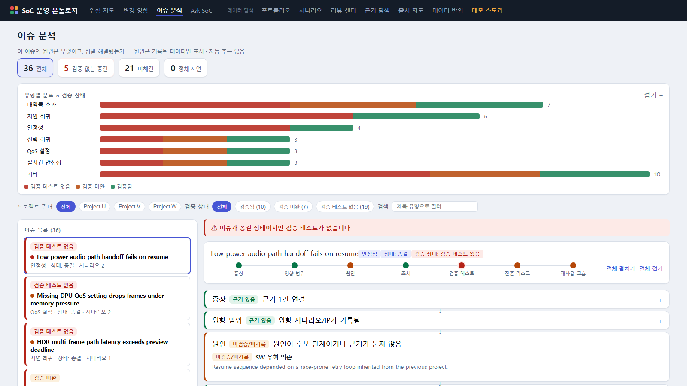
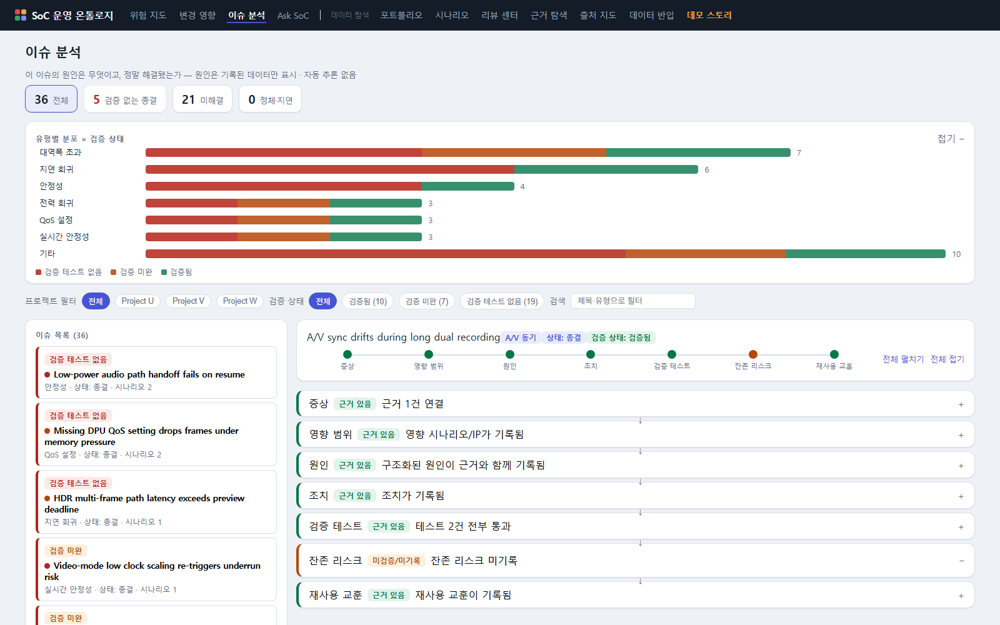

# 이슈 분석 — RCA 체인 읽는 법

> 질문: **"이 이슈의 원인은 무엇이고, 정말 해결됐나? 재발하지 않나?"**

이슈가 "close됐다"는 것과 "검증됐다"는 것은 다릅니다. 이 화면은 이슈 하나를
증상부터 재사용 교훈까지 7단 체인으로 펼치고, 각 단계에 **근거가 있는지**를 뱃지로
보여줍니다. **종결됐는데 검증 테스트가 없는 이슈가 빨갛게 드러나는 것**이 이 화면의
존재 이유입니다.

## 화면 구성

1. **이슈 상황판** (상단) — 전체/검증 없는 종결/미해결/정체·지연 숫자 카드.
   **숫자를 클릭하면 곧 필터**입니다. 그 아래 유형별 분포 막대는 길이=건수,
   색=검증 상태(빨강=검증 없음/노랑=미검증/초록=검증됨) — 막대 클릭도 필터입니다.
2. **필터** — 프로젝트(U/V/W), 검증 상태(건수 병기), 제목 검색.
3. **이슈 목록** (좌측) — 검증 상태 뱃지 + 심각도 도트(빨강=높음/노랑=중간) +
   연결 시나리오 수. **정체**(4주 이상 무활동)·**지연**(목표 주차 경과) 배지가 붙을 수
   있으며, 마우스를 올리면 판정 근거 주차가 표시됩니다.
4. **RCA 체인** (우측) — 이슈를 클릭하면 상단에 **7단 미니맵**(노드 색=근거 상태)이
   뜨고, 끊긴 고리가 즉시 보입니다. 노드를 클릭하면 해당 단계로 이동합니다.
   정상(초록) 단계는 한 줄로 접혀 있고 문제 단계만 펼쳐져 강조됩니다 —
   전체 펼치기/접기로 조절할 수 있습니다.

## 검증 상태 뱃지

| 뱃지 | 조건 | 해석 |
|---|---|---|
| 검증됨 (초록) | 연결된 테스트가 있고 전부 통과 | 해결이 테스트로 확인됨 |
| 검증 미완 (노랑) | 테스트가 있으나 실패/계획/차단 포함 | 해결 주장이 아직 확인되지 않음 |
| 검증 테스트 없음 (빨강) | 연결된 테스트가 없음 | 해결 여부를 확인할 방법이 없음 |

종결 상태인데 "검증됨"이 아니면 화면 상단에 경고 배너가 뜹니다.

## 7단 RCA 체인

각 노드는 근거 뱃지(초록=근거 있음 / 빨강=없음 / 노랑=미검증·미기록)와 판정 사유를 갖습니다.

| 단계 | 내용 | 뱃지 규칙 |
|---|---|---|
| ① 증상 | 무엇이 관찰됐나 | 증상을 뒷받침하는 근거 연결 여부 |
| ② 영향 범위 | 어떤 시나리오/IP/KPI가 영향 받나 | 영향 범위 기록 여부 — 시나리오는 상세로 링크 |
| ③ 원인 | 근본 원인 (유형 분류) | 구조화 원인+근거=초록 / 후보 단계=노랑 / 없음=빨강 |
| ④ 조치 | fix / workaround | 정식 조치=초록 / 우회만=노랑 / 종결인데 없음=빨강 |
| ⑤ **검증 테스트** | 해결을 확인한 테스트와 결과 | 전부 통과=초록 / 일부 미통과=노랑 / **없음=빨강** |
| ⑥ 잔존 리스크 | 조치 후에도 남는 위험 | 기록=초록 / 미기록=노랑 |
| ⑦ 재사용 교훈 | 차기 과제에 전달할 교훈 | 기록=초록 / 미기록=노랑 |

## 원인 유형 6종

원인은 다음 유형으로 분류되어 기록됩니다 — 어떤 유형이 반복되는지가 조직 차원의 신호입니다:

| 유형 | 의미 |
|---|---|
| 아키텍처 누락 | 설계 단계에서 고려되지 않은 경로/조건 |
| 스펙 모호성 | 문서화되지 않았거나 팀마다 다르게 읽은 스펙 |
| 검증 공백 | 테스트 범위가 그 조건을 커버하지 않았음 |
| 전력 모델 오류 | 전력/열 모델과 실측의 괴리 |
| SW 우회 의존 | 임시 우회가 정식 해법처럼 굳어진 상태 |
| 고객 시나리오 불일치 | 검증한 조건과 고객 실사용 조건의 차이 |

## 해석 시 주의

- 원인은 **기록된 데이터만** 표시합니다 — 시스템이 원인을 추론하지 않습니다.
  원인 노드가 노랑/빨강이면 "분석이 안 됐다"가 아니라 "**기록이 없다**"는 뜻입니다.
- 미기록(노랑)은 그 자체가 액션 아이템입니다: 잔존 리스크와 교훈이 비어 있는 종결 이슈는
  다음 프로젝트에서 같은 문제를 다시 만나게 됩니다.
- 테스트 항목의 hover에 테스트 ID와 연결 근거가 표시됩니다.

돌아가기: [가이드 홈](index.md) · [공통 개념](concepts.md)
