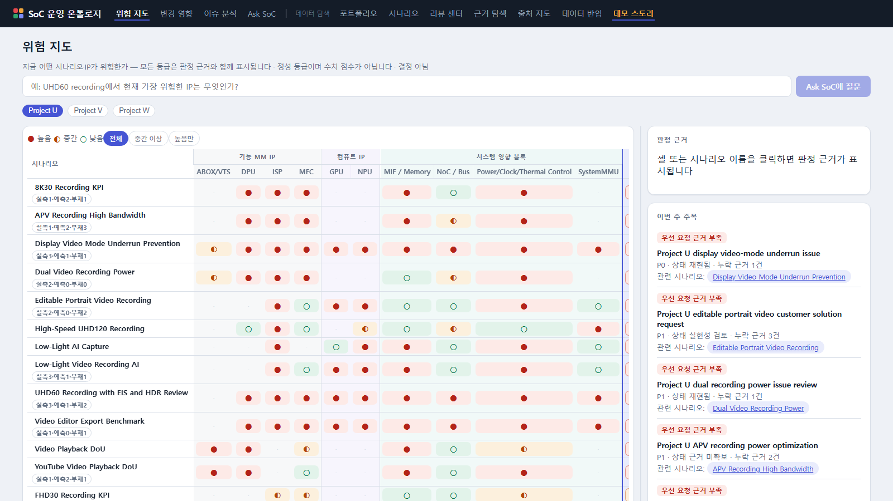
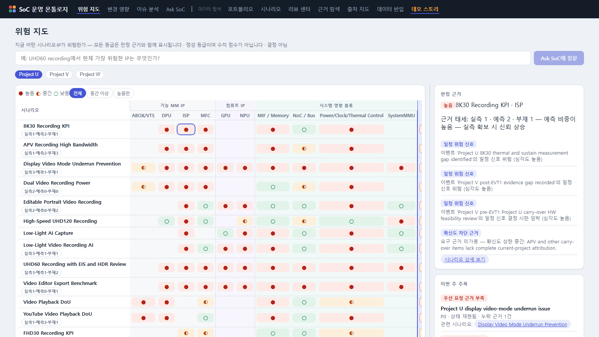

# 위험 지도 — 홈 화면 읽는 법

> 질문: **"지금 어떤 시나리오·IP가 위험한가? 근거는 무엇인가?"**

홈에 진입하면 위험 지도(heatmap)가 바로 표시됩니다. 목표는 10초 안에
"어디가 빨간가"를 파악하고, 클릭 몇 번으로 그 판정의 근거까지 내려가는 것입니다.

## 화면 구성

1. **프로젝트 탭** — Project U(양산) / V(N+1) / W(N+2). 탭을 바꾸면 해당 프로젝트와
   관련된 시나리오만 표시됩니다. 열 구성은 탭과 무관하게 고정되어 비교가 흔들리지 않습니다.
2. **Heatmap** — 행=시나리오(위험한 것부터 정렬), 열=IP·시스템 블록, 마지막 열=시나리오 종합 등급.
   열은 **기능 MM IP / 컴퓨트 IP / 시스템 영향 블록** 세 그룹으로 배경색이 구분됩니다 —
   "기능 IP는 조용한데 시스템 영향 블록이 빨갛다" 같은 패턴이 한눈에 보입니다.
3. **판정 근거 패널** (우측 상단) — 셀이나 시나리오 이름을 클릭하면 채워집니다.
   테이블과 패널 사이 세로 핸들을 드래그하면 패널 폭을 조절할 수 있습니다(더블클릭=초기화).
4. **이번 주 주목** (우측 하단) — 우선순위가 가장 높은 3~5건.

선택한 셀·필터·프로젝트 탭은 **URL에 반영**되므로, 주소를 복사해 공유하면 같은 화면이
그대로 재현됩니다 (모든 화면 공통).

## 기호와 색 읽기

| 기호 | 등급 | 색 | 해석 |
|---|---|---|---|
| ● | 높음 | 빨강 | 미해결 이슈, 낮은 확신도 상한, 심각도 높은 일정 위험 등 하드 신호 존재 |
| ◐ | 중간 | 노랑 | 주의 신호 존재 — 근거 미충족, 고심각도 이벤트, 과거 유사 이슈 등 |
| ○ | 낮음 | 초록 | 이 시나리오×IP 조합에서 감지된 위험 신호 없음 |
| · | 해당 없음 | 회색 | 이 시나리오가 그 IP를 사용/의존하지 않아 셀 자체가 없음 |

행은 종합 등급이 높은 시나리오부터 정렬되므로, **화면 상단의 빨간 행**이 이번 주 시선을
둘 곳입니다.

시나리오 이름 옆의 **근거 태세 배지**(실측N·예측N·부재N)는 그 시나리오 판단이 얹혀 있는
근거의 성격을 보여줍니다 — 빨강(실측 0건: 예측·미확보에 의존), 노랑(예측/부재 비중 높음),
초록(실측 비중 높음). 배지에 마우스를 올리면 정성 판정 문장이 표시되고, 시나리오를
선택하면 판정 근거 패널에서도 같은 태세를 확인할 수 있습니다. 점수가 아니라 건수입니다.

## 등급은 어떻게 판정되나 (결정론 룰)

등급은 수치 점수가 아니라 **룰 기반 정성 판정**입니다. 같은 데이터면 항상 같은 등급이
나오며(테스트로 고정), 발화한 룰이 그대로 근거 목록이 됩니다.

**셀(시나리오×IP) 등급 룰:**

| 룰 | 조건 | 등급 |
|---|---|---|
| 미해결 이슈 | 이 조합을 영향 범위로 갖는 열린 이슈 존재 | 높음 |
| 확신도 차단 근거 | 필요한 근거가 미가용이고 확신도 상한이 **low**로 묶임 | 높음 |
| 확신도 차단 근거 | 상한이 medium (중간 확신까지는 가능) | 중간 |
| 일정 위험 신호 | 이벤트 신호가 at_risk/delayed/window_closing **이고** 심각도 high/critical | 높음 |
| 일정 위험 신호 | 신호는 있으나 심각도 낮음 | 중간 |
| 고심각도 이벤트 | 심각도 high/critical 이벤트 진행 중 | 중간 |
| 요구 근거 미충족 | 필요 근거가 아직 미가용 (확신도 상한 없음) | 중간 |
| 과거 유사 이슈 | 같은 조합의 **종결된** 이슈 존재 — 재발 검토 대상 | 중간 |
| 위험 신호 없음 | 위 어느 것도 발화하지 않음 | 낮음 |

**시나리오 종합 등급** = 셀 중 최고 등급과 시나리오 수준 룰의 결합:

| 룰 | 조건 | 등급 |
|---|---|---|
| 우선 요청 근거 부족 | **P0** 요청이 열려 있고 누락 근거 존재 | 높음 |
| 우선 요청 근거 부족/진행 | **P1** 요청이 열려 있음 (누락 근거 있으면 강조) | 중간 |
| 근거 공백 누적 | 미해결 근거 공백(누락+미가용)이 3건 이상 | 중간 |

## 판정 근거 패널 — drill-down

셀이나 시나리오 이름을 클릭하면 우측 패널에 **그 등급을 만든 근거 목록**이 표시됩니다.

- 각 항목은 `룰 이름` 뱃지 + 원본 객체(이슈/이벤트/요청) 내용 요약입니다.
- 항목에 마우스를 올리면 원본 객체의 내부 ID가 tooltip으로 표시됩니다.
- 근거가 5건을 넘으면 접혀 있습니다 — **더 보기**로 펼치세요.
- **시나리오 상세 보기**를 누르면 해당 시나리오의 전체 상황(요청/이벤트/근거 공백/타임라인)으로
  이동합니다. 여기까지가 "주장 → 근거 → 원본"의 3클릭 경로입니다.

## 이번 주 주목

우선순위 규칙에 따라 상위 3~5건만 표시합니다:

1. **우선 요청 근거 부족** — P0/P1 요청이 열려 있는데 필요한 근거가 누락된 경우 (P0 먼저)
2. **확신도 차단** — 근거 미가용으로 판단 확신도에 상한이 걸린 경우
3. **일정 위험** — at_risk 등 일정 신호와 높은 심각도가 겹친 이벤트

같은 종류 안에서는 최근 주차가 먼저 옵니다. 각 항목의 관련 시나리오 링크로 바로 이동할 수
있습니다.

## 해석 시 주의

- 등급은 **검토 우선순위 신호**이지 결정이 아닙니다. 빨간 셀은 "여기부터 보라"는 뜻입니다.
- synthetic 데이터 특성상 신호가 밀집된 시나리오(이슈가 직접 연결된 시나리오)가 최상단에
  옵니다. 실데이터 반입 후에는 반입 데이터가 같은 룰로 판정됩니다.
- 낮음(○)은 "위험이 없다"가 아니라 "**기록된** 위험 신호가 없다"입니다 — 근거가 아직
  입력되지 않은 영역일 수 있습니다.

다음: [변경 영향 가이드](change-impact.md) · [공통 개념](concepts.md)
