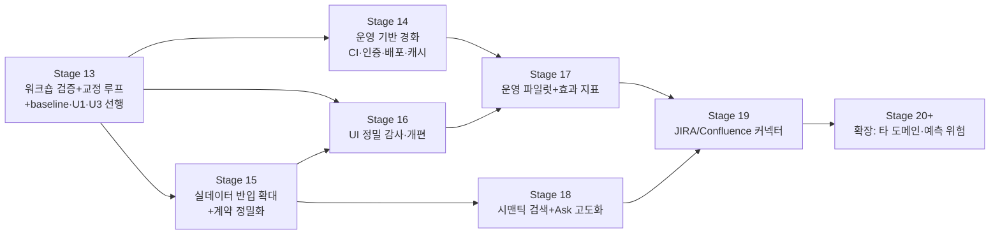

# 장기 개선 계획 — Stage 13~20 (운영 시스템 완성 로드맵)

> 상태: v1.2 (2026-07-08 — 검토 반영: G1 측정 baseline, Stage 13 2트랙 분리, UI 위생 조기화,
>   telemetry 가드 테스트, 캐시 무효화 키, 56 결합 해소, 패턴 임계값 파라미터화)
> 이전: v1.1 (2026-07-06 — Stage 16 UI 개편 삽입으로 재번호화, v1.0 대비 구 16~19가 17~20)
> 작성 목적: **다른 구현 주체(모델/개발자)가 이 문서만으로 착수할 수 있도록** 현재 상태,
> 관찰된 한계, 단계별 실행 계약을 상세히 기록한다.
> 최상위 기준: 원점 문서 `D:\YHJOO\100_SoC_Operational_Ontology\01_Brainstorming\26.06.18 SoC ontology (ChatGPT).md` (read-only)
> 선행 문서: `03_course_correction.md` (Stage 8~12 기준), `01_system_architecture.md`, `02_implementation_roadmap.md`

---

## 0. 본 목적 — 무엇을 최대화하는가

원점 문서 §8의 성공 기준이 모든 단계의 북극성이다. 화면이 늘어나는 것이 아니라
아래 지표가 개선되는 것이 성공이다:

| # | 성공 기준 (원점 §8) | 현재 담보 수단 | 장기 목표 |
|---|---|---|---|
| G1 | 정보 탐색 시간 단축 | 위험 지도 홈 + Ask SoC + 데모 TAT 로그 | 실데이터 위에서 주간 리뷰 준비 30%+ 단축을 **측정으로 입증** — 단, "단축"은 **도구 없이(control) 걸리던 시간을 먼저 확보**해야 성립한다. Stage 13에서 pre-tool baseline을 수집한다(§3.1). |
| G2 | RCA 시간 단축 | 이슈 분석 7단 체인 | 실이슈 반입 후 원인 후보 도출 시간 단축 측정 |
| G3 | 변경 영향 분석 개선 | 변경 영향 4분면 + 역할 체크리스트 | 실스펙 변경 검토에 체크리스트가 실제 사용됨 |
| G4 | 품질 근거 강화 | "검증 없는 close" 빨간 경고 | **issue close evidence 연결률**을 지표로 상시 표시 |
| G5 | 재사용성 확보 | reusable_lesson 필드 + 과거 유사 사례 | 프로젝트 간 교훈 검색이 실사용됨 |
| G6 | 확장성 검증 | 멀티미디어 5계열 archetype | 타 도메인(예: modem/connectivity) 1개 이식 실험 |

**불변 원칙 (모든 단계에서 어기면 안 되는 것 — CLAUDE.md §3, §6.3):**

1. 수치 리스크/우선순위 점수 산출·표시 금지 (정성 등급 + 근거 목록만 허용).
2. owner/task 자동 할당 금지, 결정 자동화 금지, 자율 멀티에이전트 토론 금지.
3. 온톨로지 데이터의 수정/삭제 API 금지 — 진입은 ingest 계층만, 삭제는 배치 rollback만.
4. 조회·현황·traceability는 항상 결정론. LLM은 advisory/질의 생성에만 관여하며
   provider 체인 + evidence-grounded validator + 감사 기록을 우회할 수 없다.
5. 근거 없는 답/등급/조언은 화면에 존재할 수 없다. 근거 없는 high confidence 금지.
6. 한국어 1급 (UI 문자열은 `frontend/src/i18n/ko.ts` 단일 소스, 도메인 라벨은 glossary).
7. 변경 규율: 설계문서 → Pydantic 모델(단일 소스) → JSON Schema 재생성 → fixture →
   테스트 → changelog. 코드 단독 변경 금지.
8. Stage scope lock: `CURRENT_TASK.md` 갱신 → 구현 → 전체 회귀 → changelog → commit/push →
   다음 scope lock 준비 후 **정지** (사용자 승인 없이 다음 Stage 진입 금지).

---

## 1. 현재 상태 정밀 스냅샷 (2026-07-06, 커밋 `8d27c2c`)

### 1.1 코드 지도

```text
backend/
  ontology/        # Pydantic v2 계약 8모듈 (단일 소스). event.py에 Test/RootCause 포함
  loaders/         # yaml_loader(모듈.yaml + 모듈_58.yaml 오버레이), InMemoryRepository,
                   # check_integrity (hard/soft 참조 검사)
  db/              # psycopg3, 마이그레이션 3개(core/agent_runs/ingest_batches), PostgresRepository
  resolve/         # ObjectIndex(전역 ID 해석), TraceabilityService(양방향 링크)
  services/        # 결정론 파생 뷰: scenario_analysis / portfolio / review /
                   #   risk(위험 등급 룰) / change_impact(그래프 순회) / rca(7단 체인) / common(BasisItem)
  agents/          # LLM 계층: providers(claude_cli/openai_compat), runner(advisory),
                   #   ask_runner(질의), validators(검증 관문), run_store(감사 기록)
  ingest/          # tabular(CSV/XLSX), mappings(한국어 헤더), service(배치+rollback)
  api/app.py       # read-only FastAPI + advisory/ask POST. openapi_export.py
  cli/main.py      # validate-data / db-init / db-seed / db-check / ingest-*
frontend/src/
  pages/           # RiskMap(홈)/ChangeImpact/IssueAnalysis/Ask + 기존 4화면 + 시나리오 상세 5탭
  components/      # TraceabilityPanel, CollapsibleList, SourceBadge, DemoStoryBar
  hooks/useLabels  # 내부 ID→표시명 (GET /api/v1/meta/labels)
  demo/story.ts    # 데모 4장면 정의
  i18n/ko.ts       # UI 문자열 단일 소스 (영어 하드코딩 가드 테스트 있음)
  api/             # openapi-typescript 자동 생성 (수동 타입 금지, npm run gen:api)
fixtures/          # <모듈>.yaml = 56 변환 생성물(직접 편집 금지, tools/convert_56_fixtures.py 재생성)
                   # <모듈>_58.yaml = 58 전용 synthetic (이슈 32/테스트 30)
docs/              # 사용자 UI 가이드 6문서 + 스크린샷 (GitHub Pages 소스: main /docs)
internal_docs/     # design/(설계 01~05), validation/(TAT 기준표, 워크숍 가설 22건)
```

### 1.2 검증 기준선

```bash
uv run pytest -p no:cacheprovider          # 127 passed, 9 skipped(PG DSN 게이트)
uv run ruff check backend tests tools      # pass
uv run mypy                                # pass (53 files)
uv run python -m backend.cli.main validate-data   # 오류 0 / 경고 15(56 유래 느슨한 참조)
cd frontend && npm run build && npm run test && npm run lint   # 21 tests pass
```

### 1.3 API 표면 (전부 `/api/v1`)

읽기: health, meta, meta/glossary, meta/labels, projects, scenarios(+analysis/timeline),
events, evidence, issues(+{id}/rca), traceability/{id}, portfolio/overview, review/weekly,
risk/heatmap, change-impact(+/options), ask/presets.
연산 POST(데이터 수정 아님): scenarios/{id}/advisory, ask, ingest/file, ingest/batches/{id}/rollback.
PUT/PATCH/DELETE 부재는 `tests/test_api.py::test_no_write_endpoints`가 강제한다.

### 1.4 구현 주체가 알아야 할 함정 (실수하기 쉬운 지점)

- `fixtures/<모듈>.yaml`은 생성물이다. 수정하려면 56 원본이 아니라 **모델/변환기를 고치고
  `uv run python tools/convert_56_fixtures.py`로 재생성**한다. 라운드트립 테스트
  (`test_converter_roundtrip`)가 텍스트 일치를 강제한다 (`*_58.yaml`은 비교 제외).
- 56 참조 디렉토리(`E:\56_...`)는 **살아있는 프로젝트**다 — 예고 없이 갱신되어 라운드트립이
  깨질 수 있다. 깨지면: 새 필드를 모델에 추가(optional) → 재변환 → diff 검토 → 채택.
  2026-07-05 드리프트(변형+1, source_basis)가 선례 (CHANGELOG Stage 10).
- 모델 변경 시 3종 재생성 필수: `uv run python -m backend.ontology.schema_export`,
  `uv run python -m backend.api.openapi_export`, `cd frontend && npm run gen:api`.
  드리프트는 테스트가 차단한다.
- glossary 커버리지 테스트: 새 모델/필드/enum마다 `backend/ontology/glossary.py`에
  label_ko를 추가해야 통과한다.
- 이 머신 포트 규칙: 58은 **8155(API)/5275(FE) 전용**. 8000/5173/5174/8100은 타 프로젝트
  소유 — 절대 종료/사용 금지. vite proxy 기본값이 8000이므로 반드시
  `VITE_API_TARGET=http://127.0.0.1:8155`로 기동.
- Windows 콘솔 cp949: CLI 한국어 출력이 깨져 보일 수 있다(기능 무관). 스크립트는
  `PYTHONIOENCODING=utf-8` 권장.
- 테스트는 네트워크/PostgreSQL/LLM 없이 통과해야 한다. LLM은 mock(FakeProvider 패턴,
  `tests/test_ask.py` 참조), PG는 `POSTGRES_TEST_DSN` 게이트.
- 이벤트→IP 귀속은 `IPBlock.domain/aliases` 토큰 휴리스틱(`backend/services/risk.py::
  event_related_ips`)이다 — 데이터 계약에 명시 링크가 없어서다. §3.2(온톨로지 개선)에서 해소.

### 1.5 관찰된 한계 (이번 구현에서 확인된 사실 — 개선 계획의 근거)

| # | 한계 | 영향 | 해소 단계 |
|---|---|---|---|
| L1 | CI 부재 — 회귀가 로컬 수동 실행 | 다른 주체가 안전하게 기여 불가 | Stage 14 |
| L2 | 인증/권한/HTTPS 없음 | 사내 배포 불가 | Stage 14 |
| L3 | 반입 매핑 2종뿐(마일스톤/측정) — 이슈·테스트·이벤트 반입 불가 | RCA/위험 지도가 synthetic에 갇힘 | Stage 15 |
| L4 | 검색이 키워드 토큰 매칭 — 한국어 시맨틱 없음, 단일 홉 | Ask SoC 재현율 한계 (G1·G5 제약) | Stage 18 |
| L5 | 위험 룰 임계값이 synthetic 분포에 맞춰 튜닝됨 (확신도 상한 가중, 공백 누적≥3 등) | 실데이터에서 포화/과소 판정 가능 | Stage 13 워크숍 → 교정 |
| L6 | advisory/ask 결과 캐시·비동기 없음 — 매 호출 LLM 실행(~20s) | 다중 사용자 시 지연/비용 | Stage 14 |
| L7 | TAT 로그가 localStorage 한정 — 서버 수집 없음 | 효과 측정을 집계 못 함 | Stage 17 |
| L8 | 이벤트↔IP 명시 링크 부재 (휴리스틱 귀속) | 위험 셀/유사 사례 정밀도 한계 | Stage 15(계약 확장) |
| L9 | G4 지표(close evidence 연결률)가 화면에 상시 노출되지 않음 | 품질 신호 미가시화 | Stage 17 |
| L10 | 실무자 피드백(가설 판정, 관계 교정)을 받을 in-app 경로 없음 | 워크숍 결과가 문서로만 남음 | Stage 13/15 |
| L11 | PostgreSQL 운영 절차(백업/시드 갱신/이관) 미문서화, 운영은 사실상 in-memory | 운영 신뢰성 | Stage 14 |
| L12 | 반응형/접근성 미검증 (데스크톱 1500px 기준), 값 도메인 코드 노출·URL 상태 미반영 등 UI 부채 | 파일럿 사용자 경험 (설득력 저하) | 위생 항목(값 도메인 한국어화 U1·접근성 U3)은 **Stage 13 트랙 A로 선행**, 나머지(URL 상태·스케일·로딩)는 Stage 16 (상세: `06_stage16_ui_overhaul.md`) |

---

## 2. 단계 로드맵 개관 (의존 순서)



- 순서 원칙 (원점 문서): "ingestion 자동화보다 연결 모델 검증이 먼저" → 13이 최우선.
- UI 개편(16)은 워크숍 UX 피드백(13)과 실데이터 규모(15)를 반영해 **파일럿(17) 직전**에
  완성한다 — "UI가 설득의 핵심"(03_course_correction §1). **단 값 도메인 한국어화(U1)·
  접근성(U3)은 피드백·데이터에 무관한 위생 항목이라 Stage 13 트랙 A로 당겨 선행**한다(§3.1).
- 커넥터(19)는 보안 승인이 선행 조건이므로 뒤에 배치하되, 승인 절차는 13 시점에 착수 요청.
- 각 Stage는 착수 전 `CURRENT_TASK.md`를 해당 scope로 갱신하고 사용자 승인을 받는다.

---

## 3. Stage 13 — 사내 검증 워크숍 실행 + 교정 루프 [규모: M, 사람 개입 필수]

**목적**: synthetic 위에 세운 연결 모델·룰이 실제와 맞는지 실무 리더에게 판정받고,
교정을 코드/데이터에 반영하는 **반복 가능한 루프**를 만든다. (G1~G5 전부의 전제)

**병목 주의**: 이 Stage는 워크숍(실무자 3~6명 소집)이라는 단일 인적 게이트에 의존한다.
워크숍이 지연되면 15/16/17이 전부 정지하므로, **개발이 워크숍을 기다리지 않도록 두 트랙으로
분리**한다. 트랙 A(개발 산출물)는 선행 가능하며, 트랙 B(워크숍 실행)만 인적 게이트다.

### 3.1 In-scope

**트랙 A — 개발 산출물 (워크숍 없이 선행 가능)**

1. **가설 판정 모드** (개발 항목):
   - `internal_docs/validation/02_workshop_fixture_hypotheses.md`의 가설 22건을
     화면에서 바로 판정할 수 있는 모드: 각 화면 하단에 "이 관계가 실제와
     맞나요? [맞다/아니다/조건부 + 메모]" 배너 (`?review=1` 파라미터로만 노출).
   - 판정 결과는 **온톨로지 데이터가 아니라 로컬 파일/다운로드(JSON)** 로 수집 —
     쓰기 API 금지 원칙 유지. `POST /api/v1/feedback`는 만들지 않는다.
     (수집 JSON → 사람이 검토 → 교정은 변경 규율로 반영)
   - TAT 측정 보조: 데모 스토리 요약의 "결과 복사(JSON)" 버튼 추가.
2. **pre-tool baseline 수집 도구** (G1 입증의 전제 — 신규):
   - TAT 측정(`01_tat_measurement.md` Q1~Q5)은 도구를 쓴 시간만 잰다. "30% 단축"을
     주장하려면 **도구 없이 걸리던 시간(control)** 이 있어야 한다.
   - 워크숍 시작 시 참가자가 "지금까지 이 질문(Q1~Q5)에 답하는 데 걸리던 시간"을
     자가보고로 먼저 기입하는 baseline 서식을 `01_tat_measurement.md`에 추가하고,
     `?review=1` 모드 진입 시 이 서식을 먼저 노출한다. baseline 없이 측정한
     TAT는 "단축"이 아니라 "절대 소요"로만 해석한다(문서에 명시).
3. **UI 위생 조기 이관 (C3 — Stage 16에서 당겨옴)**: 값 도메인 한국어화(U1)·접근성
   기준선(U3)은 워크숍 피드백·실데이터 규모와 무관한 순수 위생 항목이고 한국어 1급
   (CLAUDE.md #4)의 미완 부채다. **파일럿 첫인상을 위해 U1/U3만 여기서 선행**한다.
   상세 계약은 `06_stage16_ui_overhaul.md` U1/U3 그대로 사용. 나머지 UI 개편은 16에 남긴다.

**트랙 B — 워크숍 실행 + 교정 (인적 게이트)**

4. **워크숍 실행** (사람): `internal_docs/validation/` 자료로 60분 세션, 참가 3~6명.
   진행 순서에 "baseline 자가보고(트랙 A #2) → 데모 → 판정"을 포함한다.
5. **교정 반영** (개발 항목): 판정 "아니다/조건부" 항목을 백로그화 —
   - 위험 룰 가중(risk.py `RULE_LABELS`/threshold) 조정 시: 대응 테스트
     (`tests/test_risk.py`)의 고정 기대값을 함께 갱신하고 changelog에 판정 근거 기록.
   - archetype 수정: `fixtures/event_58.yaml`만 수정 (56 생성물 금지).
   - 원인 유형 enum 변경은 변경 규율 6단계 전체 필요 — 신중히.
6. `internal_docs/validation/03_workshop_results_<날짜>.md` — 판정 결과/교정 결정 기록.

### 3.2 Out-of-scope

쓰기 API·의견 저장용 DB 테이블(13에서는 금지), 룰의 수치 점수화, 신규 화면,
U1/U3를 제외한 Stage 16 UI 개편 항목(U2/U4/U5/U6는 16에 남긴다).

### 3.3 수용 기준

트랙 A (선행 가능 — 워크숍 전에 완료·검증):
- [ ] `?review=1` 모드에서 가설 22건이 해당 화면 문맥에 표시되고 판정이 JSON으로 내보내짐
- [ ] `?review=1` 진입 시 pre-tool baseline 자가보고 서식이 먼저 노출됨
- [ ] U1(값 도메인 한국어화)·U3(접근성 기준선) 수용 기준(06 문서) 충족
- [ ] 전체 회귀 통과 (기준선 §1.2)

트랙 B (워크숍 실행 후):
- [ ] 워크숍 1회 실행 → baseline + TAT 기준표 Q1~Q5 실측치 기입 완료 (전/후 대조 가능)
- [ ] "아니다" 판정 최소 1건이 실제 교정 커밋으로 이어짐 (루프 증명)
- [ ] (설계 22 W4 추가) 워크숍/리뷰 세션에서 **트윈 지표(연결률·as-of 리플레이)가
  공식 인용**됨 — 화면을 근거 자료로 쓴 실례 ≥ 1건 기록

---

## 4. Stage 14 — 운영 기반 경화: CI / 인증 / 배포 / 캐시 [규모: L]

**목적**: "내 PC에서 도는 PoC"를 "사내 서버에서 도는 운영 시스템"으로. (모든 G의 전제)

### 4.1 In-scope

1. **CI (최우선)**: GitHub Actions `.github/workflows/ci.yml` —
   - jobs: backend(uv sync → pytest/ruff/mypy/validate-data), frontend(npm ci → build/test/lint),
     contracts(schema/openapi 재생성 후 `git diff --exit-code`로 드리프트 검출).
   - 56 참조 디렉토리는 CI에 없다 → `test_converter_roundtrip`은 skipif로 자동 skip됨(이미 구현).
   - PG 통합: services 컨테이너 `pgvector/pgvector:pg16` + `POSTGRES_TEST_DSN` 주입.
2. **인증 (read-only 보호)**: 사내 표준에 따라 선택 — 우선순위:
   (a) 리버스 프록시(nginx) + 사내 SSO 헤더 신뢰 (`X-Remote-User`),
   (b) 자체 세션 없음 — API는 사용자 식별만 기록(감사 로그용), 권한 등급은 단일(조회).
   ingest/rollback POST만 관리자 헤더 요구. **비밀번호 저장/발급 구현 금지.**
3. **배포 스토리**: `deploy/` — docker-compose(backend+frontend 정적 빌드+nginx+postgres),
   환경변수 문서(`SOC_ONTOLOGY_DSN`, `SOC_ALLOW_EXTERNAL_LLM=false` 기본 — 사내 배포 시
   외부 LLM 차단이 기본값임을 명시), 시드 절차(db-init→db-seed), 백업 절차 문서.
4. **LLM 실행 경화 (L6)**:
   - advisory/ask 결과 캐시: 입력 해시(run의 input_hash 패턴 재사용) → `agent_runs` 저장
     결과 재사용, TTL/무효화는 데이터 버전(반입 배치 id 집합 해시) 기준.
     **주의(C5): 무효화 키는 데이터 버전만으로 부족하다.** advisory/ask 출력은
     프롬프트·모델에 따라 달라지므로 캐시 키에 `prompt_version`(prompts.py 버전 태그)과
     `model_id`(사용된 provider/모델)를 반드시 포함한다 — 안 그러면 프롬프트/모델 교체
     후 오래된 답이 반환된다. provider 폴백으로 응답 주체가 바뀐 경우도 다른 키로 취급.
   - ask 비동기 옵션: `POST /api/v1/ask` 즉시 202 + `GET /api/v1/ask/runs/{id}` 폴링
     (프론트는 기존 로딩 UI 유지). 감사 기록(AgentRun 계열)에 ask도 저장 — 현재 ask는
     감사 저장이 없다(개선 필요, validator notes 포함 저장).
5. 성능: risk heatmap 결과의 요청 단위 캐시(데이터 불변이면 동일) — 반입 배치 변경 시 무효화.

### 4.2 수용 기준

- [ ] PR마다 CI green이 머지 조건 (백엔드/프론트/계약 드리프트 3 job)
- [ ] docker-compose 1커맨드 기동 → 8155/5275 대신 **사내 포트 규약 문서화** 후 동작
- [ ] `SOC_ALLOW_EXTERNAL_LLM=false`에서 ask/advisory가 on-prem→결정론으로만 동작함을 테스트로 고정
- [ ] 동일 질문 2회째 ask가 캐시로 1초 내 응답 + 감사 기록 존재
- [ ] ingest POST가 관리자 식별 없이는 403

---

## 5. Stage 15 — 실데이터 반입 확대 + 계약 정밀화 [규모: L]

**목적**: RCA·위험 지도·변경 영향이 **실데이터**로 채워질 수 있게 반입 표면을 넓힌다. (G2·G4 직결)

### 5.1 In-scope

1. **반입 매핑 추가** (`backend/ingest/mappings.py` 패턴 준수 — 한국어 헤더, `;` 리스트):
   - `issues` (제목/유형/상태/증상/영향 시나리오·IP/원인 유형/조치/검증 테스트 ID/잔존/교훈),
   - `tests` (제목/유형/결과/시나리오/검증 이슈/주차),
   - `development_events` (제목/유형/심각도/일정 신호/시나리오/주차),
   - `evidence_catalog` (제목/가용성/출처 시스템/시나리오).
   - 각 매핑에 rollback 왕복 테스트 (`tests/test_ingest.py` 패턴).
2. **온톨로지 계약 정밀화 (L8 해소, 변경 규율 6단계)**:
   - `DevelopmentEvent.related_ip_ids: list[str]` (optional) 신설 — 명시 IP 링크.
     `event_related_ips()`는 "명시 링크 우선, 없으면 기존 토큰 휴리스틱" 순으로 개정.
   - `Issue.severity: str | None` (optional) 신설 — 위험 룰이 이벤트 심각도 대신
     이슈 자체 심각도를 쓸 수 있게. risk.py 룰 개정 + 테스트 갱신.
   - 두 필드 모두 optional — 56 유래 데이터 무변경 통과 (라운드트립 유지).
3. **Curation 워크플로 (L10, 쓰기 API 금지 유지)**: 실무자가 낸 교정 제안(예: "이 이슈의
   영향 IP가 틀렸다")을 CSV 템플릿으로 받아 → 검토자가 확인 → **반입 배치**로 반영하는
   절차 문서 + 템플릿 (`internal_docs/operations/curation_workflow.md`).
   기존 객체 "수정"은 새 배치의 동일 id upsert가 아니라 **정정 이력이 남는 재반입**
   (source.ref에 배치 계보)로 처리 — PostgresIngestWriter의 upsert 의미론 확인 후 설계.
4. 반입 데이터가 위험 지도/RCA에 즉시 반영됨을 확인하는 통합 테스트.

### 5.2 수용 기준

- [ ] 실무 리더 1명이 실제 이슈 10건+테스트 5건을 CSV로 반입 성공 (파일럿 데이터)
- [ ] 반입 이슈가 위험 지도 셀 등급과 RCA 목록에 나타나고, rollback 시 사라짐
- [ ] `related_ip_ids` 있는 이벤트는 휴리스틱 없이 정확 귀속 (테스트 고정)
- [ ] validate-data 오류 0 유지, 라운드트립 green 유지

---

## 6. Stage 16 — UI 정밀 감사와 개편 [규모: L]

**목적**: 파일럿 사용자가 만나는 첫인상과 일상 사용성을 완성한다 — "UI가 설득의 핵심".
**상세 설계는 별도 문서**: `internal_docs/design/06_stage16_ui_overhaul.md`
(화면별 감사 결과 R1~R6/C1~C4/I1~I3/A1~A4/D1~D4/G1~G7, Web Interface Guidelines 대조,
개선 패키지 U1~U15, 수용 기준 포함).

핵심 골자만 요약하면:
- **U1 값 도메인 한국어화**: glossary `VALUE_LABELS` 계약 신설 + fixture 전 값 커버리지
  테스트 — status/priority/severity 등 원문 코드 노출 제거 (한국어 1급 완성).
- **U2 URL=상태**: 탭/필터/선택을 URL에 반영 (공유·새로고침 재현) — 공통 원칙 7번 승격.
- **U3 접근성 기준선**: 라벨 연결/aria/포커스 링/aria-live + axe-core smoke 게이트.
- **U4 로딩·진행 규약**: LLM 대기(~20s) 스피너·경과·비활성 버튼·스켈레톤.
- **U5/U6 스케일**: heatmap sticky 열·등급 필터, 이슈/근거 목록 검색+content-visibility.

수용 기준·검증 명령은 06 문서 §6~7을 그대로 사용한다.

## 7. Stage 17 — 운영 파일럿 + 효과 지표 상시화 [규모: M]

**목적**: 실무 리더 1~2명이 **주간 업무에서 실제로 사용**하고, 효과가 지표로 보이게 한다. (G1·G4·L7·L9)

### 7.1 In-scope

1. **품질 지표 패널** (결정론, 홈 하단 접기 카드):
   - close evidence 연결률(G4): 종결 이슈 중 검증됨 비율 — RCAService 파생.
   - 근거 공백 추이: 주차별 미해결 공백 수 (기존 review 서비스 확장).
   - 수치 "점수"가 아니라 **비율/건수 지표**임을 명시 (guardrail 재확인: 리스크 점수가
     아닌 운영 지표는 허용 — 승인 필요 시 사용자 확인).
2. **TAT 서버 수집 (L7)**: 화면 전환·근거 도달 이벤트의 익명 로그를
   `POST /api/v1/telemetry` (append-only, 개인 식별 없음, 관리자만 조회)로 수집 —
   데이터 온톨로지와 분리된 별도 테이블. 주간 TAT 요약 CLI (`telemetry-report`).
   *주의: 이것은 온톨로지 쓰기가 아니라 운영 로그다 — 설계 문서에 경계 명시.*
   **가드 테스트 수정 필수(C4)**: 현재 `tests/test_api.py::test_no_write_endpoints`는
   **모든** POST/PUT/PATCH/DELETE를 차단한다. telemetry POST 추가 시 이 테스트가 깨지므로,
   "온톨로지 컬렉션에 대한 쓰기 금지"로 **범위를 재정의**한다 — 허용 목록(advisory/ask/
   ingest/rollback/telemetry)을 명시하고, 온톨로지 객체 컬렉션 경로에 대한 쓰기 부재만
   강제하도록 개정. 이 재정의 자체를 changelog에 근거와 함께 기록한다.
3. **주간 리뷰 통합**: 리뷰 센터에 "이번 주 위험 변화" 섹션 (전주 대비 등급 변화 목록 —
   스냅샷 비교, 저장은 주차별 파생 뷰 캐시).
4. 반응형 점검 (L12): 1280px/프로젝터 밝은 환경 대비 — heatmap 가로 스크롤, 폰트 대비.
5. 파일럿 운영 수칙 문서: 주 1회 반입 → 리뷰 미팅에서 위험 지도로 시작 → 피드백 CSV.

### 7.2 수용 기준

- [ ] 파일럿 사용자 주간 사용 4주 연속 + TAT 리포트 4주치 산출
- [ ] close evidence 연결률이 홈에서 상시 확인 가능
- [ ] 전주 대비 위험 변화가 리뷰 센터에 표시 (등급 변화는 근거 diff 동반)
- [ ] (설계 22 W4 추가) **게이트/주간 리뷰에서 트윈 지표가 공식 인용**됨 —
  링크 커버리지(출처 지도)·결정 리플레이(리뷰 센터)가 회의 자료·회의록에
  근거로 등장한 사례 ≥ 1건 ("대시보드냐 트윈이냐" 판정의 실사용 증거)

---

## 8. Stage 18 — 한국어 시맨틱 검색 + Ask SoC 고도화 [규모: L]

**목적**: 키워드 매칭의 재현율 한계(L4)를 넘어 "과거 비슷한 문제" 질의(G5)를 실질화한다.

### 8.1 In-scope

1. **임베딩 인덱스**: 사내 임베딩 API(on-prem) + pgvector (`semantic_chunks` 투영은
   0001 마이그레이션에 이미 준비됨). 인덱싱 대상: 이슈 증상/교훈, 이벤트 설명, 근거 제목,
   시나리오 설명. 인덱스 구축은 배치 CLI (`build-embeddings`) — 온라인 쓰기 아님.
   외부 임베딩 API 사용은 `SOC_ALLOW_EXTERNAL_LLM` 정책을 따른다.
2. **retriever 통합**: `ask_runner._search`를 "키워드 ∪ 시맨틱 상위 k" 하이브리드로 확장.
   **검색 결과는 여전히 후보일 뿐** — 카드 편입 후 인용 가능 원칙 불변 (CLAUDE.md §3).
   시맨틱 미가용(모듈/DSN 없음) 시 키워드만으로 동작 (기존 경로 회귀 테스트 유지).
3. **Ask 2홉 확장**: 1차 카드에서 traceability 1홉 이웃(이슈→검증 테스트, 시나리오→요청)을
   보조 카드로 편입 (상한 12장, 결정론). "과거 프로젝트에서 반복?" 질의가 프로젝트 경계를
   넘도록 프로젝트 축 병합 요약 카드 추가.
4. Ask 감사 기록에 retriever 종류(keyword/semantic)와 후보→카드 편입 근거 기록.

### 8.2 수용 기준

- [ ] "ISP 관련 power issue 반복 시나리오" 질의에서 키워드-미포함 유사 이슈가 회수됨
  (평가셋: 워크숍에서 만든 질의 10건, 사람 판정 재현율 기록)
- [ ] 임베딩 서비스 다운 시 키워드 경로로 무중단 동작 (테스트)
- [ ] 시맨틱 후보가 검증 관문 규칙(카드 밖 인용 금지)을 그대로 통과

---

## 9. Stage 19 — JIRA/Confluence read-only 커넥터 [규모: L, 보안 승인 선행]

**목적**: 주 1회 CSV 수작업을 자동 동기화로 대체 (G1). **원점 원칙상 13~18로 연결 모델이
검증된 뒤에만 착수.**

### 9.1 In-scope

1. 보안/계정 승인 절차 (사람, Stage 13 시점에 신청 시작 권장).
2. `backend/connectors/jira.py` — read-only REST 폴링, 프로젝트/라벨 필터 →
   기존 **ingest 계층으로만 진입** (커넥터가 직접 저장 금지): JIRA 이슈 → Issue 매핑
   (필드 매핑 표는 사내 JIRA 스키마 확정 후 설계 문서로 선행),
   `source.origin=integrated`, `source.ref=jira:<key>`.
3. 동기화 배치 = ingest 배치 — rollback 의미론 그대로.
4. Confluence: 페이지 → SemanticChunk 후보(§3 원칙: 검색 후보일 뿐 증거 아님).
5. 충돌 정책: 같은 id 재동기화는 Stage 15 curation 재반입 규칙 재사용.

### 9.2 수용 기준

- [ ] 실제 JIRA 프로젝트 1개와 주기 동기화, 반입 이력에 배치로 표시, rollback 동작
- [ ] 커넥터 장애 시 시스템은 마지막 배치 데이터로 정상 동작 (읽기 경로 무의존)
- [ ] 자격 증명은 환경변수/사내 시크릿 저장소만 — 코드/저장소에 미포함

---

## 10. Stage 20+ — 확장 실험 (탐색적, 각각 사용자 승인 필요)

1. **타 도메인 이식 (G6)**: modem/connectivity 등 1개 도메인의 IP/시나리오/archetype을
   fixture로 구성해 온톨로지 계약이 도메인 독립적인지 검증. 계약 변경이 필요하면
   그 자체가 발견이다 (변경 규율로 처리).
2. **패턴 기반 조기 경고**: "같은 원인 유형이 같은 IP 계열에서 N회 반복" 같은
   **결정론 패턴 알림** (수치 점수 아님 — 룰과 근거 목록). 위험 지도에 "재발 패턴" 뱃지.
   **스코프 크립 주의(C7)**: 이 항목은 불변 원칙의 "예측 위험/자동화 금지" 경계에 가장
   가깝다. 임계값 N을 코드에 하드코딩하면 L5식 synthetic 튜닝 문제를 재생산하므로,
   **N은 룰이 아니라 사용자/운영 설정 파라미터**로 두고 화면에 "N회 이상 반복(설정값)"으로
   근거를 노출한다. 어떤 경우에도 점수·랭킹·자동 조치로 확장하지 않는다.
3. **결정 기록 연결 강화**: decision 모듈(현재 fixture 3건)을 실사용으로 —
   리뷰에서 내린 결정을 반입해 "결정 ← 근거" 추적을 데모 4장면의 5장면째로.
4. **멀티 SoC 프로젝트 스케일**: 프로젝트 10개+ 시 heatmap 페이징/필터 UX 재설계.
5. **56 라운드트립 결합 해소 (C6 — 구조 부채)**: `fixtures/<모듈>.yaml`은 56 생성물이고
   `test_converter_roundtrip`이 텍스트 일치를 강제한다(§1.4). 살아있는 56 프로젝트가
   갱신될 때마다 라운드트립이 깨지는 취약점이 Stage가 진행될수록 커진다(선례: 2026-07-05
   드리프트). 연결 모델이 워크숍(13)으로 검증되고 실데이터(15)가 정본이 된 시점에는
   58을 56 생성물에서 **분리**(58 fixture를 정본화하고 56은 초기 시드 참조로만 강등,
   라운드트립 테스트를 스냅샷 회귀로 전환)하는 것을 검토한다. 분리 시점·방식은 사용자 승인.

---

## 11. 실행 규약 (다른 구현 주체를 위한 체크리스트)

**착수 전 반드시 읽기 (순서대로)**:
1. `CLAUDE.md` → 2. `CURRENT_TASK.md` → 3. 본 문서 해당 Stage 절 →
4. `internal_docs/design/03_course_correction.md` → 5. 관련 서비스 코드와 그 테스트.

**Stage 공통 절차**:
```text
1. CURRENT_TASK.md를 해당 Stage scope lock으로 갱신 (In/Out-scope, 수용 기준, 검증 명령)
2. 사용자 승인 확인 후 착수
3. 설계 노트가 필요한 규모(L)면 internal_docs/design/NN_*.md 먼저 작성
4. 구현 — 불변 원칙(§0) 위반 여부를 PR 셀프 체크
5. 전체 회귀 (§1.2 명령 전부) + 실구동 E2E (uvicorn 8155 + vite 5275, 브라우저 확인)
6. docs/ 사용자 가이드 갱신 (새 화면/해석 규칙이 생겼다면)
7. CHANGELOG.md 갱신 → commit/push (메시지: "Stage NN: 요약" + Co-Authored-By)
8. CURRENT_TASK.md를 다음 Stage로 갱신 후 정지 — 사용자 승인 대기
```

**품질 게이트 (어느 Stage든 동일)**:
- backend: pytest 전부 green (신규 동작마다 테스트), ruff, mypy, validate-data 오류 0
- frontend: build, vitest(신규 화면 컴포넌트 테스트 + 내부 ID 노출 가드), eslint,
  한국어 전용 가드(korean_only) 통과
- 결정론 파생 뷰는 "동일 fixture → 동일 출력" 테스트 필수
- LLM 관련 변경은 FakeProvider 계약 테스트 + validator 거부 경로 테스트 필수
