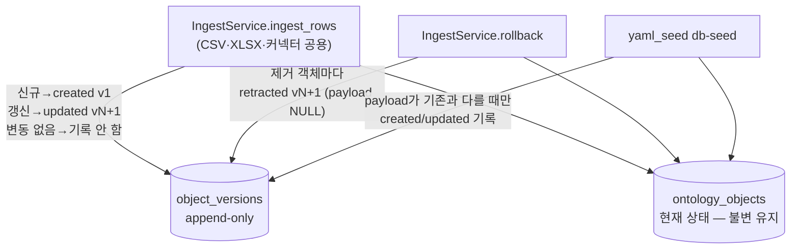

# 15. 시간 모델 — append-only 버전 로그와 as-of 재구성 기반

> 2026-07-14 digital twin 갭 분석에서 도출. 원점 문서의 "SoC 개발 lifecycle의 디지털 트윈"이
> 성립하려면 twin이 시간축을 가져야 한다 — 현재 구현은 "지금 상태"만 저장하며,
> J2 upsert 동기화는 갱신 시 이전 상태를 **파괴**한다 (`14_ingest_reality_gaps.md` §4 범위 외
> "upsert 버전 이력"이 본 설계의 착수점).
> 선행: `14_ingest_reality_gaps.md` (J2 upsert 의미론), `05_long_term_improvement_plan.md` Stage 15/19.

## 1. 문제 — 왜 지금인가 (비가역성)

| # | 사실 (현재 구현) | Digital twin 관점의 결손 |
|---|---|---|
| T-R1 | `UPSERT_OBJECT`가 `ON CONFLICT DO UPDATE`로 payload를 덮어씀. J2 갱신 경로는 `remove_by_ids` 후 재저장 | 이전 상태가 어디에도 남지 않는다. **동기화가 돌 때마다 타임라인이 지워진다** |
| T-R2 | `Issue.status`는 자유 문자열, 전이 이력 없음 | "blocker가 3주 이상 open" 류 신호(원점 아이디어 3)를 계산할 재료가 없다. J3 정체 판정은 `updated_week` 단일 값 의존 |
| T-R3 | 시간축이 `week: int`(synthetic 우주 주차 / ISO 주차) 단일 | "W12 시점에 조직이 무엇을 알고 있었나"(as-of) 재구성 불가 |
| T-R4 | rollback이 `DELETE` — 배치가 존재했다는 사실만 `ingest_batches`에 남음 | 철회된 객체의 내용이 감사 관점에서 소실 |

**시급한 이유**: 다른 갭(프로세스 모델, KPI 시계열, what-if)은 나중에 추가해도 되지만,
덮어쓴 이력은 소급 복원이 불가능하다. 사내 JIRA 실동기화(Stage 19)가 시작되기 **전에**
캡처 계층이 깔려 있어야 이후의 as-of 재구성·전이 분석·과제 간 시점 비교가 전부 가능해진다.

## 2. 대안 비교와 선택

| 대안 | 방식 | 장점 | 단점 | 판정 |
|---|---|---|---|---|
| A. Full bi-temporal | `ontology_objects`에 valid/transaction 기간 컬럼, 모든 조회를 시간 매개변수화 | as-of가 SQL 네이티브 | 모든 결정론 서비스·repository 읽기 경로 침습 수정, PG에 시스템 버전 테이블 없음, 현 규모에 과설계 | 기각 |
| B. **Append-only 버전 로그** | 현재 상태 테이블 불변 + 쓰기 관문에서 변경 시 전체 payload 스냅샷을 별도 테이블에 적재 | 읽기 경로 무변경(boring), 쓰기 관문이 이미 단일(수정 API 금지 원칙), upsert가 이미 신구 payload를 비교하므로 **추가 조회 0** | as-of는 재생(replay) 계산 필요 — 단 T3까지 보류 | **채택** |
| C. 주기 스냅샷 덤프 | 전체 상태를 주기 export | 구현 최소 | 전이 시점·granularity 소실, 저장 중복, 56 snapshot 도구 계열은 이식 제외 대상 | 기각 |

B의 성립 근거: 온톨로지 데이터의 수정/삭제 API 금지 원칙(CLAUDE.md §6.3) 덕분에
쓰기 경로가 `IngestService`(반입/커넥터)와 `yaml_seed`(시드) **둘뿐**이다.
이 두 관문에 캡처를 넣으면 구조적으로 누락이 없다.

## 3. 시간 의미론 — 두 축을 분리하고 섞지 않는다

```text
transaction time (recorded_at)  : twin이 그 사실을 알게 된 벽시계 시각 — 시스템이 기록
domain time      (week 필드들)  : 개발 우주에서 그 사실이 유효했던 시점 — 데이터가 주장
source time      (source_updated_at) : 원천 시스템(JIRA 등)이 주장하는 갱신 시각 — 있으면 보존
```

- **as-of 질의는 transaction time 위에서만 정의한다**: "그 시점에 twin이 알던 것".
  "그 시점에 현실이 그랬던 것"은 domain time의 영역이고, 이미 계약에 있는
  `week`/`updated_week`/`resolved_week`가 담당한다. 두 축을 하나로 합치려는 시도는
  거짓 정밀도를 만든다 — 하지 않는다.
- `source_updated_at`은 bi-temporal-lite 보강: JIRA `updated` 같은 원천 타임스탬프가
  행에 있으면 버전 행에 같이 보존한다 (도입 이전 이력의 근사, 정체 판정 정밀화 재료).
  없으면 NULL — 강제하지 않는다.

## 4. 설계

### 4.1 저장 계약 — `object_versions` (마이그레이션 0006)

```sql
CREATE TABLE IF NOT EXISTS object_versions (
    seq               bigint GENERATED ALWAYS AS IDENTITY PRIMARY KEY,
    collection        text        NOT NULL,
    object_id         text        NOT NULL,
    version           integer     NOT NULL,   -- (collection, object_id)별 1부터 증가
    change_kind       text        NOT NULL,   -- created | updated | retracted
    recorded_at       timestamptz NOT NULL,
    batch_id          text,                   -- ingest 배치 / 'seed:<ts>' — 계보
    source_origin     text        NOT NULL,
    source_updated_at timestamptz,            -- 원천 주장 시각 (JIRA updated 등, optional)
    changed_fields    text[]      NOT NULL DEFAULT '{}',  -- 직전 버전과 다른 top-level 필드
    payload           jsonb,                  -- 변경 후 전체 스냅샷. retracted는 NULL
    UNIQUE (collection, object_id, version)
);
CREATE INDEX IF NOT EXISTS idx_object_versions_object
    ON object_versions (collection, object_id, version);
CREATE INDEX IF NOT EXISTS idx_object_versions_recorded
    ON object_versions (recorded_at);
```

설계 결정과 근거:

- **전체 스냅샷, diff 저장 아님**: payload는 작은 JSONB이고 diff 재조립은 오류원이다.
  diff(`changed_fields` 상세)는 읽기 시점에 인접 버전 비교로 결정론 계산한다.
  `changed_fields` 배열은 쓰기 시점에 이미 손에 있는 신구 payload 비교의 부산물 —
  목록 화면용 편의이며, 진실은 payload 쌍이다.
- **append-only**: 이 테이블에는 UPDATE/DELETE가 없다. **rollback도 로그를 지우지
  않는다** — `retracted` 버전을 추가한다 (§4.3).
- **unchanged는 버전을 만들지 않는다**: J2의 "변동 없음 = 쓰지 않음" 의미론을 그대로
  승계 — 로그 크기가 실제 변경량에 비례한다.
- 이 테이블은 온톨로지 컬렉션이 아니라 **감사 인프라**다 (`agent_runs`/`ask_log`와
  같은 지위). ingest로 진입하지 않고, fixture에 없고, JSON Schema 대상이 아니다.
- 버전 번호는 쓰기 시 `COALESCE(MAX(version), 0) + 1` — 반입은 단일 프로세스 배치
  단위라 경합이 없다 (B2 커넥션 계층 전제 유지).

### 4.2 Pydantic 계약 — `backend/ingest/history.py` (신규 모듈)

```python
class ObjectVersion(BaseModel):        # 감사 인프라 — OntologyObject 아님
    collection: str
    object_id: str
    version: int
    change_kind: str                   # created | updated | retracted
    recorded_at: str
    batch_id: str | None
    source_origin: str
    source_updated_at: str | None
    changed_fields: list[str]
    payload: dict | None               # retracted는 None

class StatusTransition(BaseModel):     # 읽기 시점 파생 — 저장하지 않음
    object_id: str
    from_status: str | None            # created 버전은 None
    to_status: str
    version: int
    recorded_at: str
    source_updated_at: str | None
```

`VALUE_LABELS`에 `change_kind` 도메인 추가: 생성/갱신/철회.

### 4.3 캡처 지점 — 쓰기 관문 3곳 (구조적 완전성)



1. **`ingest_rows`**: J2 3분류가 이미 신구 payload를 갖고 있다(§ upsert 비교) —
   같은 자리에서 버전 행을 만들어 `append_versions`로 넘긴다. `source` 메타 제외
   비교 규칙(J2)을 `changed_fields` 계산에도 동일 적용.
2. **`rollback`**: `remove_batch`가 제거하는 객체 목록을 확보해 각각 `retracted`
   버전을 추가한다. **rollback 의미론은 불변**(현재 소유 객체 제거) — 로그는 철회
   사실을 남길 뿐이다. "이전 상태 복원"(J2 문서의 미착수 후보)은 이 로그가
   가능하게 만드는 **미래 옵션**이지 본 Stage 범위가 아니다.
3. **`db-seed`**: 시드는 매 실행 전 객체를 UPSERT하므로 나이브하게 걸면 실행마다
   버전이 불어난다. 시드에도 J2와 같은 payload 비교를 적용해 **다를 때만** 기록
   (`batch_id = "seed:<ISO ts>"`). 현재 상태 쓰기 자체는 기존대로 유지 — 캡처만 조건부.

`IngestWriterProtocol` 확장 (in-memory/PG 패리티 — J2의 교훈):

```python
def append_versions(self, entries: list[ObjectVersion]) -> None: ...
def latest_version_numbers(self, collection: str, ids: list[str]) -> dict[str, int]: ...
def list_versions(self, collection: str, object_id: str) -> list[ObjectVersion]: ...
```

`MemoryIngestWriter`는 리스트로 동일 계약 구현 — 테스트는 PG 없이 통과(불변 원칙).

### 4.4 읽기 표면 — 단계 분리

| 단계 | 내용 | 지위 |
|---|---|---|
| **T1 캡처** | §4.1~4.3 전부 + `sync-status`/배치 상세에 버전 카운트 표시 + CLI `history <collection> <id>` | **본 Stage — 지금** |
| **T2 전이 조회** | `GET /api/v1/history/{collection}/{id}` (버전 목록 + status 전이 추출) — 이슈 상세/RCA에 "상태 전이 타임라인" 섹션, 정체 판정(J3) 근거에 전이 이력 인용 | 본 Stage 포함 (읽기 전용 GET — `test_no_write_endpoints` 불변) |
| **T3 as-of 재구성** | `?as_of=<ts>`로 임의 시점 상태 재생 → 파생 뷰(위험 지도 등) 재계산 | **범위 외 — 별도 승인.** 실데이터 이력이 쌓인 뒤에만 의미 있음 |

Status 전이 추출은 결정론: 버전 payload 시퀀스에서 `status` 필드 변화만 뽑는다
(`StatusTransition`). 저장하지 않고 조회 시 계산 — 파생 뷰는 저장 계약이 아니라는
기존 원칙(CLAUDE.md §2.3) 그대로.

### 4.5 범위에서 제외하는 것 (명시)

- **`relations`/`semantic_chunks` 테이블**: 별도 투영 테이블이며 현재 시드 전용
  저채널 경로. 커넥터가 이 테이블에 쓰기 시작하는 Stage에서 같은 패턴으로 확장한다.
- **as-of 파생 뷰(T3)**, **rollback→이전 상태 복원**, **JIRA changelog API 백필**
  (도입 이전 전이를 원천 이력에서 합성 — `source_updated_at`이 그 자리를 예약한다).
- **retention 정책**: 파일럿 규모(수천 객체·주간 동기화)에서 로그 증가는 무시 가능.
  Stage 19 대량 동기화 시점에 재평가.
- KPI 시계열·프로세스 모델·what-if는 별개 갭 — 본 설계는 그들의 **전제**(시간축)만 놓는다.

## 5. 불변 원칙 확인

- 쓰기는 여전히 ingest/seed 관문뿐 — 버전 로그는 그 관문의 부수 기록이며 자체
  진입 경로가 없다. PUT/PATCH/DELETE 부재 불변.
- 조회·전이 추출은 전부 결정론. 수치 점수 없음 — 전이 이력은 사실 나열이다.
- append-only: 로그에 대한 수정/삭제 경로를 만들지 않는다 (rollback 포함).
- 한국어 1급: `change_kind` 값 라벨, UI 문자열은 `ko.ts` 경유.
- 계약 변경 규율: 온톨로지 8모듈 모델은 **무변경** → JSON Schema 재생성 불필요.
  API 추가로 openapi 재생성 + `npm run gen:api`는 필요.

## 6. 수용 기준

1. 반입 → 같은 id 갱신 반입 → rollback 시나리오에서 버전 체인이
   `created(v1) → updated(v2) → retracted(v3)`로 남고, 변동 없음 재반입은 버전을
   만들지 않는다 (in-memory + PG 게이트 테스트 양쪽).
2. `db-seed` 2회 연속 실행 시 두 번째 실행이 버전을 만들지 않는다 (시드 멱등).
3. `changed_fields`가 실제 달라진 top-level 필드와 일치한다 (`source` 메타 제외).
4. status 전이 추출이 버전 시퀀스에서 결정론적으로 계산된다 — 동일 입력 동일 출력.
5. `GET /api/v1/history/...`는 읽기 전용 — `test_no_write_endpoints` 통과 유지.
6. 전체 회귀 green: pytest / ruff / mypy / validate-data / frontend build·test·lint.

## 7. 구현 순서 (승인 후)

1. 마이그레이션 `0006_object_versions.sql` + `backend/ingest/history.py` 모델
2. `IngestWriterProtocol` 확장 + Memory/Postgres 구현 (패리티 테스트 동시)
3. `ingest_rows`/`rollback` 캡처 → `yaml_seed` 조건부 캡처
4. CLI `history` + `GET /api/v1/history/{collection}/{id}` + openapi/gen:api 재생성
5. UI: 이슈 상세 전이 타임라인 (T2 최소 표면)
6. changelog + `CURRENT_TASK.md` 갱신

## 8. 구현 상태

- **T1+T2 구현 완료 (2026-07-14)** — 수용 기준 §6 전 항목 검증:
  버전 체인·unchanged 무기록·재반입 번호 연속(`tests/test_history.py` 9건),
  시드 멱등·PG 패리티(`test_postgres_integration.py` +2건, soc_test DB 11/11),
  API 3건(`test_api.py` — no-write 계약 불변), 전체 회귀 green
  (backend 235 / frontend 34 / ruff / mypy / validate-data 오류 0).
- 세부 편차: rollback 철회 기록용으로 protocol에 `owned_object_keys(batch_id)`
  읽기 메서드 추가 (§4.3-2의 구현 세부 — 제거 전 소유 객체·origin 확보).
- 운영 DB(soc_ontology)에 0006 적용 완료.
- **T3(as-of 재구성) 구현 완료 (2026-07-15)** — `16_digital_twin_followups.md` §3
  (P2)로 승인·구현: `AsOfService` + `GET /as-of/risk/heatmap?ts=` + 위험 지도
  시점 재구성 UI. §4.4의 단계 분리 표는 이로써 전부 해소.
